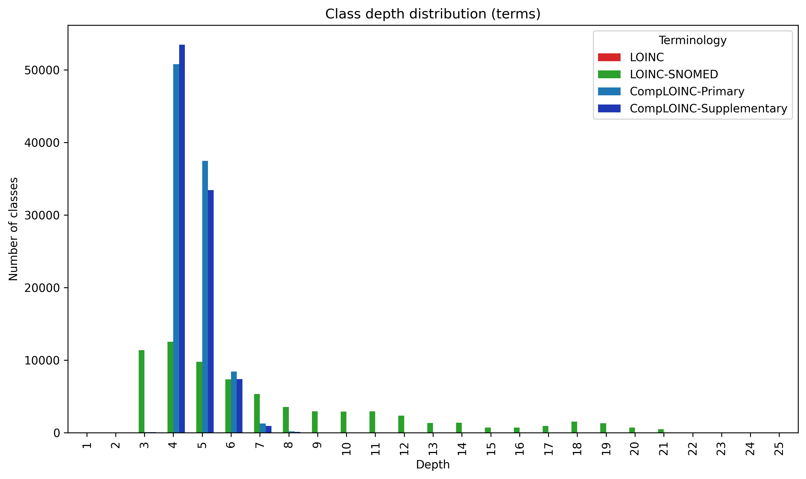

# Classification depth analysis 
This measures how deep into the hierarchy each class is. E.g. if the root of the hierarchy is TermA, and we have axioms
(TermC subClassOf TermB) and (TermB subClassOf TermA), then TermC is at depth 3, TermB is at depth 2, and TermA is at 
depth 1.

**Dangling classes** 
Dangling classes are not represented here in this class depth analysis.

*Ramifications for LOINC*
Note that this results in LOINC showing that it has 0 terms at any depths, as LOINC has no term hierarchy. The only 
hierarchies that exist in LOINC are a shallow grouping hierarchy (represented by CSVs in `AccessoryFiles/GroupFile/` in 
the LOINC release, and the part hierarchy, which is not represented in the release, but only exists in the LOINC tree 
browser (https://loinc.org/tree/). Regarding parts, there are also a large number of those that are dangling even after 
when considering all of the tree browser hierarchies, and those as well are not represented here. 

*Ramifications for CompLOINC*
The only dangling classes in CompLOINC are dangling parts from the LOINC release, specifically the ones which CompLOINC 
was not able to find matches. Those classes are not represented here.

## Number of classes (terms)

|   depth |   LOINC |   LOINC-SNOMED |   CompLOINC-Primary |   CompLOINC-Supplementary |
|---------|---------|----------------|---------------------|---------------------------|
|       1 |       0 |              1 |                   2 |                         2 |
|       2 |       0 |             10 |               14784 |                       218 |
|       3 |       0 |             67 |                7175 |                       304 |
|       4 |       0 |            394 |               49464 |                     48046 |
|       5 |       0 |            815 |               46991 |                     37797 |
|       6 |       0 |           1649 |               34165 |                     13610 |
|       7 |       0 |           2033 |               40233 |                      6447 |
|       8 |       0 |           1955 |               44807 |                      4949 |
|       9 |       0 |           1998 |               47085 |                      4279 |
|      10 |       0 |           2289 |               44233 |                      3919 |
|      11 |       0 |           2632 |               39259 |                      3730 |
|      12 |       0 |           2180 |               31651 |                      3206 |
|      13 |       0 |           1191 |               24755 |                      2853 |
|      14 |       0 |           1226 |               17704 |                      2398 |
|      15 |       0 |            611 |               11341 |                      2047 |
|      16 |       0 |            630 |                5781 |                      1881 |
|      17 |       0 |            876 |                3203 |                      1792 |
|      18 |       0 |           1506 |                2014 |                      1729 |
|      19 |       0 |           1291 |                1403 |                      1369 |
|      20 |       0 |            701 |                 748 |                       746 |
|      21 |       0 |            492 |                 514 |                       514 |
|      22 |       0 |             56 |                  58 |                        58 |
|      23 |       0 |              9 |                  11 |                        11 |
|      24 |       0 |              2 |                   2 |                         2 |
|      25 |       0 |              1 |                   1 |                         1 |

## % of classes (terms)

|   depth |   LOINC |   LOINC-SNOMED |   CompLOINC-Primary |   CompLOINC-Supplementary |
|---------|---------|----------------|---------------------|---------------------------|
|       1 |       0 |         0.0041 |             0.00043 |                    0.0014 |
|       2 |       0 |         0.041  |             3.2     |                    0.15   |
|       3 |       0 |         0.27   |             1.5     |                    0.21   |
|       4 |       0 |         1.6    |            11       |                   34      |
|       5 |       0 |         3.3    |            10       |                   27      |
|       6 |       0 |         6.7    |             7.3     |                    9.6    |
|       7 |       0 |         8.3    |             8.6     |                    4.5    |
|       8 |       0 |         7.9    |             9.6     |                    3.5    |
|       9 |       0 |         8.1    |            10       |                    3      |
|      10 |       0 |         9.3    |             9.5     |                    2.8    |
|      11 |       0 |        11      |             8.4     |                    2.6    |
|      12 |       0 |         8.9    |             6.8     |                    2.3    |
|      13 |       0 |         4.8    |             5.3     |                    2      |
|      14 |       0 |         5      |             3.8     |                    1.7    |
|      15 |       0 |         2.5    |             2.4     |                    1.4    |
|      16 |       0 |         2.6    |             1.2     |                    1.3    |
|      17 |       0 |         3.6    |             0.69    |                    1.3    |
|      18 |       0 |         6.1    |             0.43    |                    1.2    |
|      19 |       0 |         5.2    |             0.3     |                    0.96   |
|      20 |       0 |         2.8    |             0.16    |                    0.53   |
|      21 |       0 |         2      |             0.11    |                    0.36   |
|      22 |       0 |         0.23   |             0.012   |                    0.041  |
|      23 |       0 |         0.037  |             0.0024  |                    0.0078 |
|      24 |       0 |         0.0081 |             0.00043 |                    0.0014 |
|      25 |       0 |         0.0041 |             0.00021 |                    0.0007 |

## Number of classes (terms, groups)

|   depth |   LOINC |   LOINC-SNOMED |   CompLOINC-Primary |   CompLOINC-Supplementary |
|---------|---------|----------------|---------------------|---------------------------|
|       1 |       0 |              1 |                 937 |                       931 |
|       2 |       0 |             10 |               17919 |                      3353 |
|       3 |       0 |             67 |                9348 |                      2477 |
|       4 |       0 |            394 |               51590 |                     50172 |
|       5 |       0 |            815 |               51182 |                     41988 |
|       6 |       0 |           1649 |               42663 |                     22108 |
|       7 |       0 |           2033 |               51655 |                     17869 |
|       8 |       0 |           1955 |               55182 |                     15324 |
|       9 |       0 |           1998 |               55508 |                     12702 |
|      10 |       0 |           2289 |               50547 |                     10233 |
|      11 |       0 |           2632 |               43861 |                      8332 |
|      12 |       0 |           2180 |               34468 |                      6023 |
|      13 |       0 |           1191 |               26197 |                      4295 |
|      14 |       0 |           1226 |               18253 |                      2947 |
|      15 |       0 |            611 |               11512 |                      2218 |
|      16 |       0 |            630 |                5796 |                      1896 |
|      17 |       0 |            876 |                3204 |                      1793 |
|      18 |       0 |           1506 |                2014 |                      1729 |
|      19 |       0 |           1291 |                1403 |                      1369 |
|      20 |       0 |            701 |                 748 |                       746 |
|      21 |       0 |            492 |                 514 |                       514 |
|      22 |       0 |             56 |                  58 |                        58 |
|      23 |       0 |              9 |                  11 |                        11 |
|      24 |       0 |              2 |                   2 |                         2 |
|      25 |       0 |              1 |                   1 |                         1 |

## % of classes (terms, groups)

|   depth |   LOINC |   LOINC-SNOMED |   CompLOINC-Primary |   CompLOINC-Supplementary |
|---------|---------|----------------|---------------------|---------------------------|
|       1 |       0 |         0.0041 |             0.18    |                   0.45    |
|       2 |       0 |         0.041  |             3.4     |                   1.6     |
|       3 |       0 |         0.27   |             1.7     |                   1.2     |
|       4 |       0 |         1.6    |             9.7     |                  24       |
|       5 |       0 |         3.3    |             9.6     |                  20       |
|       6 |       0 |         6.7    |             8       |                  11       |
|       7 |       0 |         8.3    |             9.7     |                   8.5     |
|       8 |       0 |         7.9    |            10       |                   7.3     |
|       9 |       0 |         8.1    |            10       |                   6.1     |
|      10 |       0 |         9.3    |             9.5     |                   4.9     |
|      11 |       0 |        11      |             8.2     |                   4       |
|      12 |       0 |         8.9    |             6.4     |                   2.9     |
|      13 |       0 |         4.8    |             4.9     |                   2.1     |
|      14 |       0 |         5      |             3.4     |                   1.4     |
|      15 |       0 |         2.5    |             2.2     |                   1.1     |
|      16 |       0 |         2.6    |             1.1     |                   0.91    |
|      17 |       0 |         3.6    |             0.6     |                   0.86    |
|      18 |       0 |         6.1    |             0.38    |                   0.83    |
|      19 |       0 |         5.2    |             0.26    |                   0.65    |
|      20 |       0 |         2.8    |             0.14    |                   0.36    |
|      21 |       0 |         2      |             0.096   |                   0.25    |
|      22 |       0 |         0.23   |             0.011   |                   0.028   |
|      23 |       0 |         0.037  |             0.0021  |                   0.0053  |
|      24 |       0 |         0.0081 |             0.00037 |                   0.00096 |
|      25 |       0 |         0.0041 |             0.00019 |                   0.00048 |

## Number of classes (terms, groups, parts)

|   depth |   LOINC |   LOINC-SNOMED |   CompLOINC-Primary |   CompLOINC-Supplementary |
|---------|---------|----------------|---------------------|---------------------------|
|       1 |       1 |              1 |                 938 |                       932 |
|       2 |   29739 |             10 |               47303 |                     32737 |
|       3 |    3675 |             67 |               13154 |                      6283 |
|       4 |    8402 |            394 |               60882 |                     59464 |
|       5 |    3690 |            815 |               57251 |                     48057 |
|       6 |   11362 |           1649 |               60346 |                     39791 |
|       7 |   19671 |           2033 |               80699 |                     46913 |
|       8 |   24602 |           1955 |               87334 |                     47476 |
|       9 |   21502 |           1998 |               85514 |                     42708 |
|      10 |   12661 |           2289 |               76095 |                     35781 |
|      11 |    7646 |           2632 |               66099 |                     30570 |
|      12 |    3628 |           2180 |               53605 |                     25160 |
|      13 |    1190 |           1191 |               42935 |                     21033 |
|      14 |     134 |           1226 |               32340 |                     17034 |
|      15 |      10 |            611 |               23226 |                     13932 |
|      16 |       0 |            630 |               15170 |                     11270 |
|      17 |       0 |            876 |               10761 |                      9350 |
|      18 |       0 |           1506 |                8515 |                      8230 |
|      19 |       0 |           1291 |                6943 |                      6909 |
|      20 |       0 |            701 |                4893 |                      4891 |
|      21 |       0 |            492 |                3255 |                      3255 |
|      22 |       0 |             56 |                1273 |                      1273 |
|      23 |       0 |              9 |                 120 |                       120 |
|      24 |       0 |              2 |                  28 |                        28 |
|      25 |       0 |              1 |                   8 |                         8 |

## % of classes (terms, groups, parts)

|   depth |    LOINC |   LOINC-SNOMED |   CompLOINC-Primary |   CompLOINC-Supplementary |
|---------|----------|----------------|---------------------|---------------------------|
|       1 |  0.00068 |         0.0041 |             0.11    |                    0.18   |
|       2 | 20       |         0.041  |             5.6     |                    6.4    |
|       3 |  2.5     |         0.27   |             1.6     |                    1.2    |
|       4 |  5.7     |         1.6    |             7.3     |                   12      |
|       5 |  2.5     |         3.3    |             6.8     |                    9.4    |
|       6 |  7.7     |         6.7    |             7.2     |                    7.8    |
|       7 | 13       |         8.3    |             9.6     |                    9.1    |
|       8 | 17       |         7.9    |            10       |                    9.3    |
|       9 | 15       |         8.1    |            10       |                    8.3    |
|      10 |  8.6     |         9.3    |             9.1     |                    7      |
|      11 |  5.2     |        11      |             7.9     |                    6      |
|      12 |  2.5     |         8.9    |             6.4     |                    4.9    |
|      13 |  0.8     |         4.8    |             5.1     |                    4.1    |
|      14 |  0.091   |         5      |             3.9     |                    3.3    |
|      15 |  0.0068  |         2.5    |             2.8     |                    2.7    |
|      16 |  0       |         2.6    |             1.8     |                    2.2    |
|      17 |  0       |         3.6    |             1.3     |                    1.8    |
|      18 |  0       |         6.1    |             1       |                    1.6    |
|      19 |  0       |         5.2    |             0.83    |                    1.3    |
|      20 |  0       |         2.8    |             0.58    |                    0.95   |
|      21 |  0       |         2      |             0.39    |                    0.63   |
|      22 |  0       |         0.23   |             0.15    |                    0.25   |
|      23 |  0       |         0.037  |             0.014   |                    0.023  |
|      24 |  0       |         0.0081 |             0.0033  |                    0.0055 |
|      25 |  0       |         0.0041 |             0.00095 |                    0.0016 |

