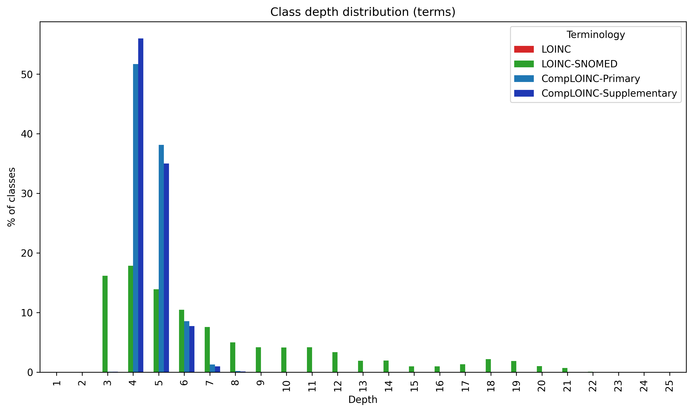
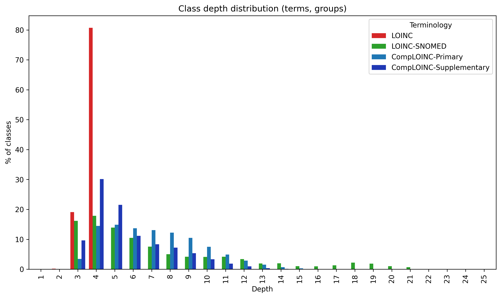
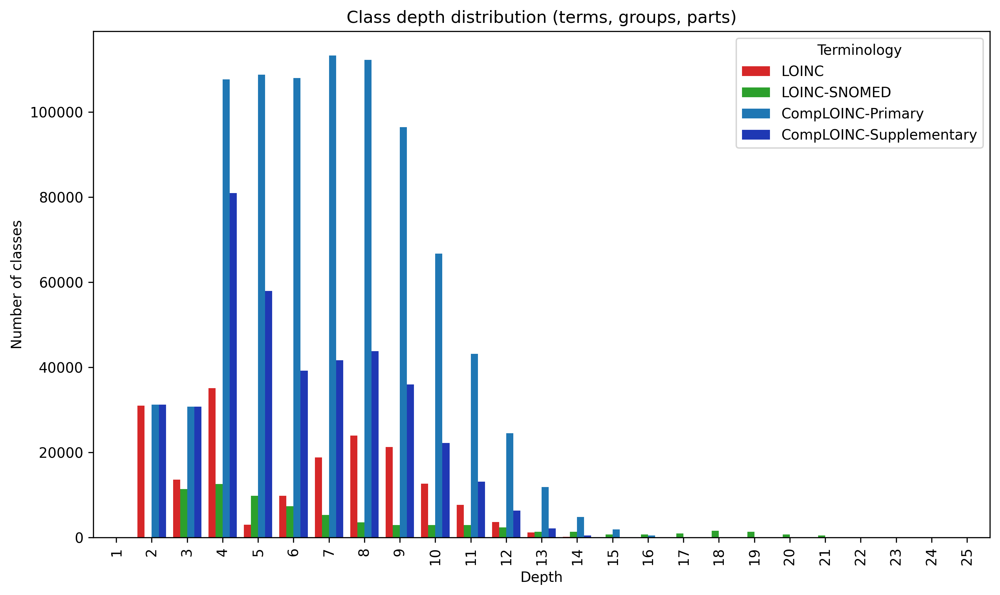
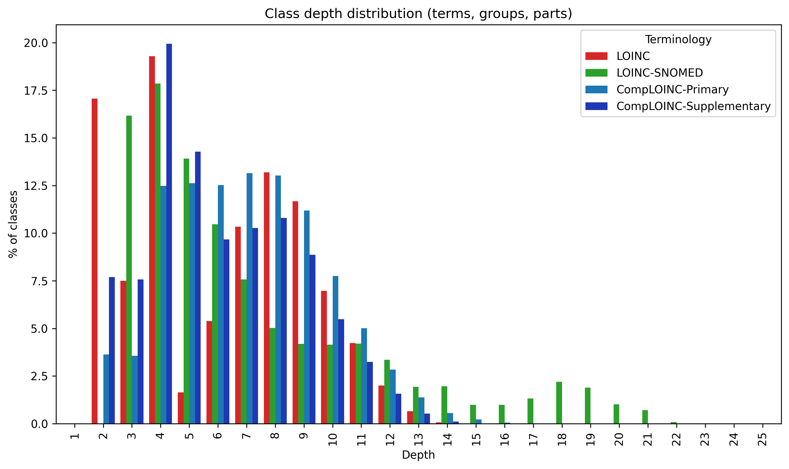

# Classification depth analysis 
This measures how deep into the hierarchy each class is. E.g. if the root of the hierarchy is TermA, and we have axioms
(TermC subClassOf TermB) and (TermB subClassOf TermA), then TermC is at depth 3, TermB is at depth 2, and TermA is at 
depth 1.

## Polyhierarchies and their effect on counts
CompLOINC and the LOINC and LOINC-SNOMED representations are all polyhierarchies. This means that classes can appear 
multiple times. For this analysis, we have decided to include every occurrence of a class in the counts. For example, if
a class appears in 3 subtrees, once at depth 3, and in two subtrees at depth 2, this class will be tallied twice at 
depth 2, and once at depth 3. 

## Dangling classes  
Dangling classes are not represented here in this class depth analysis.

**Ramifications for CompLOINC**  
The only dangling classes in CompLOINC are dangling parts from the LOINC release, specifically the ones which CompLOINC 
was not able to find matches. Those classes are not represented here.

**Ramifications for LOINC representation**  
Note that this results in LOINC showing that it has 0 terms at any depths, as LOINC has no term hierarchy. The only 
hierarchies that exist in LOINC are a shallow grouping hierarchy (represented by CSVs in `AccessoryFiles/GroupFile/` in 
the LOINC release, and the part hierarchy, which is not represented in the release, but only exists in the LOINC tree 
browser (https://loinc.org/tree/). Regarding parts, there are also a large number of those that are dangling even after 
when considering all of the tree browser hierarchies, and those as well are not represented here. 

## LOINC representation
LOINC itself does not have an `.owl` representaiton, but for this analysis we constructed one. The following are some 
caveats about the representation, by class type.

**Terms**  
LOINC defines no term-term subclass relationships. It only defines term-group relationships. Therefore, for the analyses 
where we consider only terms, the term-group subclass axioms are intentionally dropped, resulting in no axioms at all, 
and therefore rendering LOINC to show 0 classes at any depth.  

**Parts**  
Some variations of the outputs include part classes. The LOINC release does not establish part-part subclass 
relationships. These relationships are obtained by exports from the LOINC tree browser: https://loinc.org/tree/.

**Groups**  
Some variations of the outputs include parts group classes. While the LOINC release does not have term-term or part-part
subclass axioms, it does have such "axioms" for group-group and term-group. `Group.csv`: Defines relationships between 
groups and parent groups. `GroupLoincTerms.csv`: Defines relationships between terms (`LoincNumber` column) and groups 
(`GroupId` column). Also defines relationships between categories (`Category` column) and groups/terms. For this 
analysis, we consider categories to be just another kind of group. This results in our representation of LOINC groups 
being a polyhierarchy, as terms and groups can fall under other groups, but also can fall under categories. Thus, such 
terms and groups will be counted multiple times in the depths counts. 

More information about LOINC groups can be found here: https://loinc.org/groups/

---

## Number of classes (terms)

|   depth |   LOINC |   LOINC-SNOMED |   CompLOINC-Primary |   CompLOINC-Supplementary |
|---------|---------|----------------|---------------------|---------------------------|
|       1 |       0 |              1 |                   2 |                         2 |
|       2 |       0 |             10 |                  19 |                        19 |
|       3 |       0 |             67 |                 319 |                       319 |
|       4 |       0 |            394 |               43791 |                     48521 |
|       5 |       0 |            815 |               42921 |                     39553 |
|       6 |       0 |           1649 |               22136 |                     18638 |
|       7 |       0 |           2033 |               19880 |                     17132 |
|       8 |       0 |           1955 |               18675 |                     17434 |
|       9 |       0 |           1998 |               16475 |                     16151 |
|      10 |       0 |           2289 |               16432 |                     16338 |
|      11 |       0 |           2632 |               17732 |                     17724 |
|      12 |       0 |           2180 |               17403 |                     17401 |
|      13 |       0 |           1191 |               14513 |                     14513 |
|      14 |       0 |           1226 |               12046 |                     12046 |
|      15 |       0 |            611 |                9363 |                      9363 |
|      16 |       0 |            630 |                6823 |                      6823 |
|      17 |       0 |            876 |                6044 |                      6044 |
|      18 |       0 |           1506 |                6180 |                      6180 |
|      19 |       0 |           1291 |                5940 |                      5940 |
|      20 |       0 |            701 |                4536 |                      4536 |
|      21 |       0 |            492 |                3101 |                      3101 |
|      22 |       0 |             56 |                1212 |                      1212 |
|      23 |       0 |              9 |                 111 |                       111 |
|      24 |       0 |              2 |                  25 |                        25 |
|      25 |       0 |              1 |                   8 |                         8 |

## % of classes (terms)

|   depth |   LOINC |   LOINC-SNOMED |   CompLOINC-Primary |   CompLOINC-Supplementary |
|---------|---------|----------------|---------------------|---------------------------|
|       1 |       0 |         0.0041 |              0.0007 |                   0.00072 |
|       2 |       0 |         0.041  |              0.0067 |                   0.0068  |
|       3 |       0 |         0.27   |              0.11   |                   0.11    |
|       4 |       0 |         1.6    |             15      |                  17       |
|       5 |       0 |         3.3    |             15      |                  14       |
|       6 |       0 |         6.7    |              7.7    |                   6.7     |
|       7 |       0 |         8.3    |              7      |                   6.1     |
|       8 |       0 |         7.9    |              6.5    |                   6.2     |
|       9 |       0 |         8.1    |              5.8    |                   5.8     |
|      10 |       0 |         9.3    |              5.8    |                   5.9     |
|      11 |       0 |        11      |              6.2    |                   6.3     |
|      12 |       0 |         8.9    |              6.1    |                   6.2     |
|      13 |       0 |         4.8    |              5.1    |                   5.2     |
|      14 |       0 |         5      |              4.2    |                   4.3     |
|      15 |       0 |         2.5    |              3.3    |                   3.4     |
|      16 |       0 |         2.6    |              2.4    |                   2.4     |
|      17 |       0 |         3.6    |              2.1    |                   2.2     |
|      18 |       0 |         6.1    |              2.2    |                   2.2     |
|      19 |       0 |         5.2    |              2.1    |                   2.1     |
|      20 |       0 |         2.8    |              1.6    |                   1.6     |
|      21 |       0 |         2      |              1.1    |                   1.1     |
|      22 |       0 |         0.23   |              0.42   |                   0.43    |
|      23 |       0 |         0.037  |              0.039  |                   0.04    |
|      24 |       0 |         0.0081 |              0.0088 |                   0.009   |
|      25 |       0 |         0.0041 |              0.0028 |                   0.0029  |

## Number of classes (terms, groups)

|   depth |   LOINC |   LOINC-SNOMED |   CompLOINC-Primary |   CompLOINC-Supplementary |
|---------|---------|----------------|---------------------|---------------------------|
|       1 |      61 |              1 |                 937 |                       931 |
|       2 |    7168 |             10 |               17720 |                      3154 |
|       3 |   30327 |             67 |                9363 |                      2492 |
|       4 |       0 |            394 |               52065 |                     50647 |
|       5 |       0 |            815 |               52938 |                     43744 |
|       6 |       0 |           1649 |               47691 |                     27136 |
|       7 |       0 |           2033 |               62340 |                     28554 |
|       8 |       0 |           1955 |               67667 |                     27809 |
|       9 |       0 |           1998 |               67380 |                     24574 |
|      10 |       0 |           2289 |               62966 |                     22652 |
|      11 |       0 |           2632 |               57855 |                     22326 |
|      12 |       0 |           2180 |               48663 |                     20218 |
|      13 |       0 |           1191 |               37857 |                     15955 |
|      14 |       0 |           1226 |               27901 |                     12595 |
|      15 |       0 |            611 |               18828 |                      9534 |
|      16 |       0 |            630 |               10738 |                      6838 |
|      17 |       0 |            876 |                7456 |                      6045 |
|      18 |       0 |           1506 |                6465 |                      6180 |
|      19 |       0 |           1291 |                5974 |                      5940 |
|      20 |       0 |            701 |                4538 |                      4536 |
|      21 |       0 |            492 |                3101 |                      3101 |
|      22 |       0 |             56 |                1212 |                      1212 |
|      23 |       0 |              9 |                 111 |                       111 |
|      24 |       0 |              2 |                  25 |                        25 |
|      25 |       0 |              1 |                   8 |                         8 |

## % of classes (terms, groups)

|   depth |   LOINC |   LOINC-SNOMED |   CompLOINC-Primary |   CompLOINC-Supplementary |
|---------|---------|----------------|---------------------|---------------------------|
|       1 |    0.16 |         0.0041 |              0.14   |                    0.27   |
|       2 |   19    |         0.041  |              2.6    |                    0.91   |
|       3 |   81    |         0.27   |              1.4    |                    0.72   |
|       4 |    0    |         1.6    |              7.8    |                   15      |
|       5 |    0    |         3.3    |              7.9    |                   13      |
|       6 |    0    |         6.7    |              7.1    |                    7.8    |
|       7 |    0    |         8.3    |              9.3    |                    8.2    |
|       8 |    0    |         7.9    |             10      |                    8      |
|       9 |    0    |         8.1    |             10      |                    7.1    |
|      10 |    0    |         9.3    |              9.4    |                    6.5    |
|      11 |    0    |        11      |              8.6    |                    6.4    |
|      12 |    0    |         8.9    |              7.2    |                    5.8    |
|      13 |    0    |         4.8    |              5.6    |                    4.6    |
|      14 |    0    |         5      |              4.2    |                    3.6    |
|      15 |    0    |         2.5    |              2.8    |                    2.8    |
|      16 |    0    |         2.6    |              1.6    |                    2      |
|      17 |    0    |         3.6    |              1.1    |                    1.7    |
|      18 |    0    |         6.1    |              0.96   |                    1.8    |
|      19 |    0    |         5.2    |              0.89   |                    1.7    |
|      20 |    0    |         2.8    |              0.68   |                    1.3    |
|      21 |    0    |         2      |              0.46   |                    0.9    |
|      22 |    0    |         0.23   |              0.18   |                    0.35   |
|      23 |    0    |         0.037  |              0.017  |                    0.032  |
|      24 |    0    |         0.0081 |              0.0037 |                    0.0072 |
|      25 |    0    |         0.0041 |              0.0012 |                    0.0023 |

## Number of classes (terms, groups, parts)

|   depth |   LOINC |   LOINC-SNOMED |   CompLOINC-Primary |   CompLOINC-Supplementary |
|---------|---------|----------------|---------------------|---------------------------|
|       1 |      62 |              1 |                 938 |                       932 |
|       2 |   36907 |             10 |               47303 |                     32737 |
|       3 |   34002 |             67 |               13154 |                      6283 |
|       4 |    8406 |            394 |               60882 |                     59464 |
|       5 |    3735 |            815 |               57251 |                     48057 |
|       6 |   11474 |           1649 |               60346 |                     39791 |
|       7 |   19887 |           2033 |               80699 |                     46913 |
|       8 |   24922 |           1955 |               87334 |                     47476 |
|       9 |   21787 |           1998 |               85514 |                     42708 |
|      10 |   12833 |           2289 |               76095 |                     35781 |
|      11 |    7702 |           2632 |               66099 |                     30570 |
|      12 |    3634 |           2180 |               53605 |                     25160 |
|      13 |    1191 |           1191 |               42935 |                     21033 |
|      14 |     134 |           1226 |               32340 |                     17034 |
|      15 |      10 |            611 |               23226 |                     13932 |
|      16 |       0 |            630 |               15170 |                     11270 |
|      17 |       0 |            876 |               10761 |                      9350 |
|      18 |       0 |           1506 |                8515 |                      8230 |
|      19 |       0 |           1291 |                6943 |                      6909 |
|      20 |       0 |            701 |                4893 |                      4891 |
|      21 |       0 |            492 |                3255 |                      3255 |
|      22 |       0 |             56 |                1273 |                      1273 |
|      23 |       0 |              9 |                 120 |                       120 |
|      24 |       0 |              2 |                  28 |                        28 |
|      25 |       0 |              1 |                   8 |                         8 |

## % of classes (terms, groups, parts)

|   depth |   LOINC |   LOINC-SNOMED |   CompLOINC-Primary |   CompLOINC-Supplementary |
|---------|---------|----------------|---------------------|---------------------------|
|       1 |  0.033  |         0.0041 |             0.11    |                    0.18   |
|       2 | 20      |         0.041  |             5.6     |                    6.4    |
|       3 | 18      |         0.27   |             1.6     |                    1.2    |
|       4 |  4.5    |         1.6    |             7.3     |                   12      |
|       5 |  2      |         3.3    |             6.8     |                    9.4    |
|       6 |  6.1    |         6.7    |             7.2     |                    7.8    |
|       7 | 11      |         8.3    |             9.6     |                    9.1    |
|       8 | 13      |         7.9    |            10       |                    9.3    |
|       9 | 12      |         8.1    |            10       |                    8.3    |
|      10 |  6.9    |         9.3    |             9.1     |                    7      |
|      11 |  4.1    |        11      |             7.9     |                    6      |
|      12 |  1.9    |         8.9    |             6.4     |                    4.9    |
|      13 |  0.64   |         4.8    |             5.1     |                    4.1    |
|      14 |  0.072  |         5      |             3.9     |                    3.3    |
|      15 |  0.0054 |         2.5    |             2.8     |                    2.7    |
|      16 |  0      |         2.6    |             1.8     |                    2.2    |
|      17 |  0      |         3.6    |             1.3     |                    1.8    |
|      18 |  0      |         6.1    |             1       |                    1.6    |
|      19 |  0      |         5.2    |             0.83    |                    1.3    |
|      20 |  0      |         2.8    |             0.58    |                    0.95   |
|      21 |  0      |         2      |             0.39    |                    0.63   |
|      22 |  0      |         0.23   |             0.15    |                    0.25   |
|      23 |  0      |         0.037  |             0.014   |                    0.023  |
|      24 |  0      |         0.0081 |             0.0033  |                    0.0055 |
|      25 |  0      |         0.0041 |             0.00095 |                    0.0016 |

