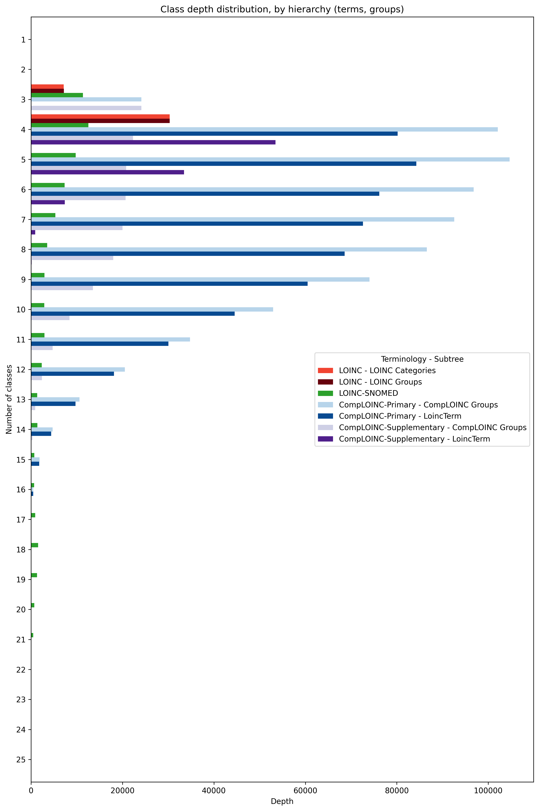
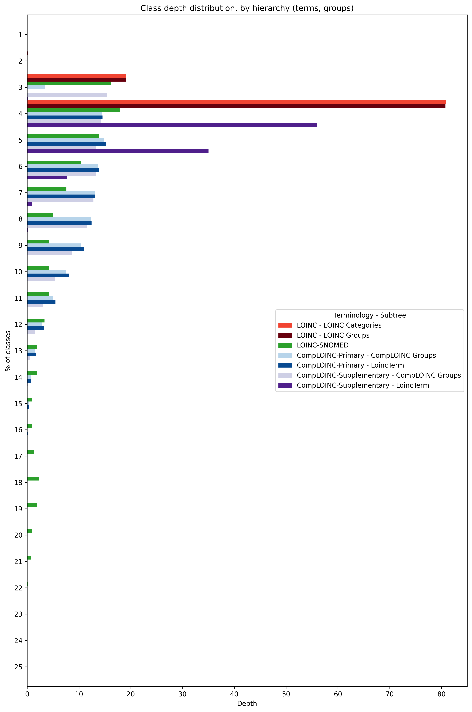
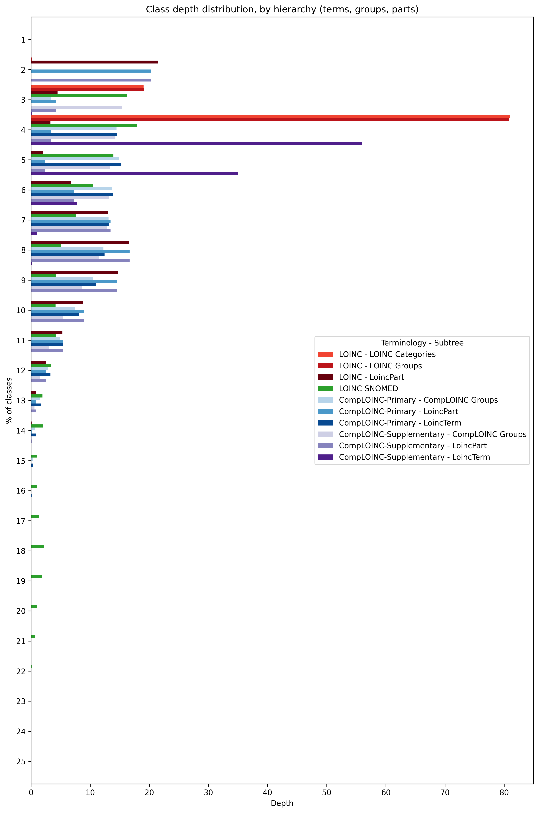

# Classification depth analysis 
This measures how deep into the hierarchy each class is. E.g. if the root of the hierarchy is TermA, and we have axioms
(TermC subClassOf TermB) and (TermB subClassOf TermA), then TermC is at depth 3, TermB is at depth 2, and TermA is at 
depth 1.

## Web application: https://comp-loinc.onrender.com/
Can take ~5 minutes to load when asleep. Sleeps when unused for 15 minutes. Contains interactive variations of these 
plots.

## Polyhierarchies
**Impact on class depths**  
CompLOINC and the LOINC and LOINC-SNOMED representations are all polyhierarchies. This means that classes can appear 
multiple times. For this analysis, we have decided to include every occurrence of a class in the counts. For example, if
a class appears in 3 subtrees, once at depth 3, and in two subtrees at depth 2, this class will be tallied twice at 
depth 2, and once at depth 3. 

**Disaggregating major subtrees**  
CompLOINC and LOINC have more than 1 top-level branches (AKA subhierachies or subtrees).

| Terminology | Hierarchy name   | Root URI                        |
|-------------|------------------|---------------------------------|
| CompLOINC   | SNOMED-Inspired  | https://loinc.org/138875005     |
| CompLOINC   | LoincTerm        | https://loinc.org/LoincTerm     |
| CompLOINC   | CompLOINC Groups | http://comploinc/group          |
| CompLOINC   | LoincPart        | https://loinc.org/LoincPart     |
| LOINC       | LOINC Categories | https://loinc.org/LoincCategory |
| LOINC       | LOINC Groups     | https://loinc.org/LoincGroup    |
| LOINC       | LoincPart        | https://loinc.org/LoincPart     |

Note, by subtree:
- *SNOMED-Inspired*: This is inspired largely by the LOINC-SNOMED Ontology.
- *LoincTerm*: LOINC has no Term hierarchy. It has a part hierarchy in the tree browser (https://loinc.org/tree/), which 
has parts as leaves. CompLOINC has a term hierarchy based on inference, combining the part hierarchy from the tree 
browser with supplementary or primary part model definitions.
- *LoincPart*: Exists in the LOINC tree browser, but not the official LOINC release. CompLOINC includes it as an 
optional subtree, largely obtained.
- *LOINC Groups*: Part of the LOINC release. See more: https://loinc.org/groups/. Terms are grouped, and some groups 
have groups. Also just for this analysis, we have added a single, novel https://loinc.org/LoincGroup root as a parent of
the otherwise top level groups in the LOINC release.
- *LOINC Categories*: Part of  the LOINC release, but not as formal as LOINC groups. These categories have no URIs, just 
labels. They are parents only of groups, not terms. From https://loinc.org/groups/: 'Category: A short description that 
identifies the general purpose of the group, such as "Flowsheet", "Reportable microbiology" or "Document ontology 
grouped by role and subject matter domain".'
- *CompLOINC Groups*: CompLOINC has a novel grouping class hierarchy. It does not utilize LOINC groups or categories in 
the LOINC release. The top level class is "http://comploinc/group", followed by a major group branch for each "property 
axis" (that is, a single part property or combination thereof), e.g. "http://comploinc/group/component/". Then, groups 
which are defined via these properties descend from there. 

**Two sets of outputs**  
In many cases, the best way to use each of these is not to use the entire polyhierarchy, but individual major subtrees. 
As such, we have produced a set of "by hierarchy" outputs, where these major subtrees have been disaggregated. The other
set of outputs aggregates all of the subtrees together in its counts. 

## Class types
We consider the following 3 types of classes: terms, parts, and groups. There are 3 sets of outputs with respect to 
class types: terms only, terms+groups, and terms+groups+parts.

There are also different kinds of possible axioms in CompLOINC, LOINC, and LOINC-SNOMED Ontology, with respect to class 
types.  

Homogeneous
- term --> term
- part --> part
- group --> group

Heterogeneous
- term --> part
- part --> term
- term --> group
- group --> term
- part --> group
- group --> part 

For a given filter of class type, we discard any subclass axioms where either the parent or child is not included. So, 
for example if we are only looking at 'terms', we only consider the term-->term axioms. If we are looking at 
'terms+groups', we retain axioms for term-->term, group-->group, term-->group, and group-->term.

## Dangling classes  
Dangling classes are not represented here in this class depth analysis.

**Ramifications for CompLOINC**  
The only dangling classes in CompLOINC are dangling parts from the LOINC release, specifically the ones which CompLOINC 
was not able to find matches. Those classes are not represented here.

**Ramifications for LOINC representation**  
Note that this results in LOINC showing that it has 0 terms at any depths, as LOINC has no term hierarchy. The only 
hierarchies that exist in LOINC are a shallow grouping hierarchy (represented by CSVs in `AccessoryFiles/GroupFile/` in 
the LOINC release, and the part hierarchy, which is not represented in the release, but only exists in the LOINC tree 
browser (https://loinc.org/tree/). Regarding parts, there are also a large number of those that are dangling even after 
when considering all of the tree browser hierarchies, and those as well are not represented here. 

**Dangling subtrees**  
There is also the case where, as a result of filtering class types, there end up being dangling sub-trees. For example, 
it could be that somewhere in a hierarchy, there is a term-group axiom, which is the root of its own subtree. If we are 
filtering to show terms only, then this axiom gets removed, leaving its descendants (subtree) dangling. This subtree may
contain term-term axioms, which would otherwise be kept, but since they are part of a dangling subtree, they are 
removed. 

## CompLOINC representation
**Grouping class depths adjusted via synthetic "master grouping classes"**  
This particular analysis makes small modifications to the CompLOINC representation with respect to groups. In the 
CompLOINC .owl artefacts, there are many top-level grouping classes at the root of the ontology. These top level 
grouping classes come in various sets, one for each LOINC property or combination of properties used to construct the 
groups. For example, the grouping class http://comploinc/group/component/LP16066-0 falls under the "component" property 
axis, while the grouping class http://comploinc/group/component-system/LP7795-0-LP310005-6 falls under the 
"component+system" property (combination) axis. If these parts for these properties have no parents, then these grouping
classes will reside at the root of CompLOINC. However, for these classification depth analyses, we are comparing against 
other subtrees that have a single root, e.g. LoincPart or LoincTerm. Therefore, for the depths to be consistent along 
class types (terms, parts, groups), we have included "master grouping classes" just for this analysis. The top level for
all grouping clases is http://comploinc/group/ ("GRP"), and the children of this class are all of the roots of each 
property axis, e.g. http://comploinc/group/component/ ("GRP_CMP"), http://comploinc/group/component-system/ ("GRP_SYS"),
and so on.

## LOINC representation
LOINC itself does not have an `.owl` representaiton, but for this analysis we constructed one. The following are some 
caveats about the representation, by class type.

**Terms**  
LOINC defines no term-term subclass relationships. It only defines term-group relationships. Therefore, for the analyses 
where we consider only terms, the term-group subclass axioms are intentionally dropped, resulting in no axioms at all, 
and therefore rendering LOINC to show 0 classes at any depth.  

**Parts**  
Some variations of the outputs include part classes. The LOINC release does not establish part-part subclass 
relationships. These relationships are obtained by exports from the LOINC tree browser: https://loinc.org/tree/.

**Groups**  
Some variations of the outputs include parts group classes. While the LOINC release does not have term-term or part-part
subclass axioms, it does have such "axioms" for group-group and term-group. `Group.csv`: Defines relationships between 
groups and parent groups. `GroupLoincTerms.csv`: Defines relationships between terms (`LoincNumber` column) and groups 
(`GroupId` column). Also defines relationships between categories (`Category` column) and groups/terms. For this 
analysis, we consider categories to be just another kind of group. This results in our representation of LOINC groups 
being a polyhierarchy, as terms and groups can fall under other groups, but also can fall under categories. Thus, such 
terms and groups will be counted multiple times in the depths counts. 

More information about LOINC groups can be found here: https://loinc.org/groups/

---

## Counts, by data processing stage
| filter               | terminology             | stage                 | metric         |   value |
|----------------------|-------------------------|-----------------------|----------------|---------|
| terms                | LOINC                   | 1: raw_input          | subclass pairs |  177265 |
| terms                | LOINC                   | 1: raw_input          | classes        |  153742 |
| terms                | LOINC                   | 1: raw_input          | roots          |      62 |
| terms                | LOINC                   | 2: post_new_groupings | subclass pairs |  177265 |
| terms                | LOINC                   | 2: post_new_groupings | classes        |  153742 |
| terms                | LOINC                   | 2: post_new_groupings | roots          |      62 |
| terms                | LOINC                   | 3: post_filters       | subclass pairs |       0 |
| terms                | LOINC                   | 3: post_filters       | classes        |   30327 |
| terms                | LOINC                   | 3: post_filters       | roots          |   30327 |
| terms                | LOINC                   | 4: post_pruning       | subclass pairs |       0 |
| terms                | LOINC                   | 4: post_pruning       | classes        |       0 |
| terms                | LOINC                   | 4: post_pruning       | roots          |       0 |
| terms                | LOINC-SNOMED            | 1: raw_input          | subclass pairs |   11376 |
| terms                | LOINC-SNOMED            | 1: raw_input          | classes        |    7963 |
| terms                | LOINC-SNOMED            | 1: raw_input          | roots          |       1 |
| terms                | LOINC-SNOMED            | 2: post_new_groupings | subclass pairs |   11376 |
| terms                | LOINC-SNOMED            | 2: post_new_groupings | classes        |    7963 |
| terms                | LOINC-SNOMED            | 2: post_new_groupings | roots          |       1 |
| terms                | LOINC-SNOMED            | 3: post_filters       | subclass pairs |   11376 |
| terms                | LOINC-SNOMED            | 3: post_filters       | classes        |    7963 |
| terms                | LOINC-SNOMED            | 3: post_filters       | roots          |       1 |
| terms                | LOINC-SNOMED            | 4: post_pruning       | subclass pairs |   11376 |
| terms                | LOINC-SNOMED            | 4: post_pruning       | classes        |    7963 |
| terms                | LOINC-SNOMED            | 4: post_pruning       | roots          |       1 |
| terms                | CompLOINC-Primary       | 1: raw_input          | subclass pairs |  422349 |
| terms                | CompLOINC-Primary       | 1: raw_input          | classes        |  241791 |
| terms                | CompLOINC-Primary       | 1: raw_input          | roots          |     938 |
| terms                | CompLOINC-Primary       | 2: post_new_groupings | subclass pairs |  422349 |
| terms                | CompLOINC-Primary       | 2: post_new_groupings | classes        |  241791 |
| terms                | CompLOINC-Primary       | 2: post_new_groupings | roots          |     938 |
| terms                | CompLOINC-Primary       | 3: post_filters       | subclass pairs |  120819 |
| terms                | CompLOINC-Primary       | 3: post_filters       | classes        |  103412 |
| terms                | CompLOINC-Primary       | 3: post_filters       | roots          |      71 |
| terms                | CompLOINC-Primary       | 4: post_pruning       | subclass pairs |  120387 |
| terms                | CompLOINC-Primary       | 4: post_pruning       | classes        |  103104 |
| terms                | CompLOINC-Primary       | 4: post_pruning       | roots          |       2 |
| terms                | CompLOINC-Supplementary | 1: raw_input          | subclass pairs |  360244 |
| terms                | CompLOINC-Supplementary | 1: raw_input          | classes        |  241785 |
| terms                | CompLOINC-Supplementary | 1: raw_input          | roots          |     932 |
| terms                | CompLOINC-Supplementary | 2: post_new_groupings | subclass pairs |  360244 |
| terms                | CompLOINC-Supplementary | 2: post_new_groupings | classes        |  241785 |
| terms                | CompLOINC-Supplementary | 2: post_new_groupings | roots          |     932 |
| terms                | CompLOINC-Supplementary | 3: post_filters       | subclass pairs |  147034 |
| terms                | CompLOINC-Supplementary | 3: post_filters       | classes        |  103412 |
| terms                | CompLOINC-Supplementary | 3: post_filters       | roots          |      71 |
| terms                | CompLOINC-Supplementary | 4: post_pruning       | subclass pairs |  146602 |
| terms                | CompLOINC-Supplementary | 4: post_pruning       | classes        |  103104 |
| terms                | CompLOINC-Supplementary | 4: post_pruning       | roots          |       2 |
| terms, groups        | LOINC                   | 1: raw_input          | subclass pairs |  177265 |
| terms, groups        | LOINC                   | 1: raw_input          | classes        |  153742 |
| terms, groups        | LOINC                   | 1: raw_input          | roots          |      62 |
| terms, groups        | LOINC                   | 2: post_new_groupings | subclass pairs |  177326 |
| terms, groups        | LOINC                   | 2: post_new_groupings | classes        |  153744 |
| terms, groups        | LOINC                   | 2: post_new_groupings | roots          |       3 |
| terms, groups        | LOINC                   | 3: post_filters       | subclass pairs |   56877 |
| terms, groups        | LOINC                   | 3: post_filters       | classes        |   37558 |
| terms, groups        | LOINC                   | 3: post_filters       | roots          |       2 |
| terms, groups        | LOINC                   | 4: post_pruning       | subclass pairs |   56877 |
| terms, groups        | LOINC                   | 4: post_pruning       | classes        |   37558 |
| terms, groups        | LOINC                   | 4: post_pruning       | roots          |       2 |
| terms, groups        | LOINC-SNOMED            | 1: raw_input          | subclass pairs |   11376 |
| terms, groups        | LOINC-SNOMED            | 1: raw_input          | classes        |    7963 |
| terms, groups        | LOINC-SNOMED            | 1: raw_input          | roots          |       1 |
| terms, groups        | LOINC-SNOMED            | 2: post_new_groupings | subclass pairs |   11376 |
| terms, groups        | LOINC-SNOMED            | 2: post_new_groupings | classes        |    7963 |
| terms, groups        | LOINC-SNOMED            | 2: post_new_groupings | roots          |       1 |
| terms, groups        | LOINC-SNOMED            | 3: post_filters       | subclass pairs |   11376 |
| terms, groups        | LOINC-SNOMED            | 3: post_filters       | classes        |    7963 |
| terms, groups        | LOINC-SNOMED            | 3: post_filters       | roots          |       1 |
| terms, groups        | LOINC-SNOMED            | 4: post_pruning       | subclass pairs |   11376 |
| terms, groups        | LOINC-SNOMED            | 4: post_pruning       | classes        |    7963 |
| terms, groups        | LOINC-SNOMED            | 4: post_pruning       | roots          |       1 |
| terms, groups        | CompLOINC-Primary       | 1: raw_input          | subclass pairs |  422349 |
| terms, groups        | CompLOINC-Primary       | 1: raw_input          | classes        |  241791 |
| terms, groups        | CompLOINC-Primary       | 1: raw_input          | roots          |     938 |
| terms, groups        | CompLOINC-Primary       | 2: post_new_groupings | subclass pairs |  444545 |
| terms, groups        | CompLOINC-Primary       | 2: post_new_groupings | classes        |  241795 |
| terms, groups        | CompLOINC-Primary       | 2: post_new_groupings | roots          |       4 |
| terms, groups        | CompLOINC-Primary       | 3: post_filters       | subclass pairs |  277664 |
| terms, groups        | CompLOINC-Primary       | 3: post_filters       | classes        |  125609 |
| terms, groups        | CompLOINC-Primary       | 3: post_filters       | roots          |      72 |
| terms, groups        | CompLOINC-Primary       | 4: post_pruning       | subclass pairs |  277232 |
| terms, groups        | CompLOINC-Primary       | 4: post_pruning       | classes        |  125301 |
| terms, groups        | CompLOINC-Primary       | 4: post_pruning       | roots          |       3 |
| terms, groups        | CompLOINC-Supplementary | 1: raw_input          | subclass pairs |  360244 |
| terms, groups        | CompLOINC-Supplementary | 1: raw_input          | classes        |  241785 |
| terms, groups        | CompLOINC-Supplementary | 1: raw_input          | roots          |     932 |
| terms, groups        | CompLOINC-Supplementary | 2: post_new_groupings | subclass pairs |  382434 |
| terms, groups        | CompLOINC-Supplementary | 2: post_new_groupings | classes        |  241789 |
| terms, groups        | CompLOINC-Supplementary | 2: post_new_groupings | roots          |       4 |
| terms, groups        | CompLOINC-Supplementary | 3: post_filters       | subclass pairs |  215553 |
| terms, groups        | CompLOINC-Supplementary | 3: post_filters       | classes        |  125603 |
| terms, groups        | CompLOINC-Supplementary | 3: post_filters       | roots          |      72 |
| terms, groups        | CompLOINC-Supplementary | 4: post_pruning       | subclass pairs |  215121 |
| terms, groups        | CompLOINC-Supplementary | 4: post_pruning       | classes        |  125295 |
| terms, groups        | CompLOINC-Supplementary | 4: post_pruning       | roots          |       3 |
| terms, groups, parts | LOINC                   | 1: raw_input          | subclass pairs |  177265 |
| terms, groups, parts | LOINC                   | 1: raw_input          | classes        |  153742 |
| terms, groups, parts | LOINC                   | 1: raw_input          | roots          |      62 |
| terms, groups, parts | LOINC                   | 2: post_new_groupings | subclass pairs |  177326 |
| terms, groups, parts | LOINC                   | 2: post_new_groupings | classes        |  153744 |
| terms, groups, parts | LOINC                   | 2: post_new_groupings | roots          |       3 |
| terms, groups, parts | LOINC                   | 3: post_filters       | subclass pairs |  177326 |
| terms, groups, parts | LOINC                   | 3: post_filters       | classes        |  153744 |
| terms, groups, parts | LOINC                   | 3: post_filters       | roots          |       3 |
| terms, groups, parts | LOINC                   | 4: post_pruning       | subclass pairs |  177326 |
| terms, groups, parts | LOINC                   | 4: post_pruning       | classes        |  153744 |
| terms, groups, parts | LOINC                   | 4: post_pruning       | roots          |       3 |
| terms, groups, parts | LOINC-SNOMED            | 1: raw_input          | subclass pairs |   11376 |
| terms, groups, parts | LOINC-SNOMED            | 1: raw_input          | classes        |    7963 |
| terms, groups, parts | LOINC-SNOMED            | 1: raw_input          | roots          |       1 |
| terms, groups, parts | LOINC-SNOMED            | 2: post_new_groupings | subclass pairs |   11376 |
| terms, groups, parts | LOINC-SNOMED            | 2: post_new_groupings | classes        |    7963 |
| terms, groups, parts | LOINC-SNOMED            | 2: post_new_groupings | roots          |       1 |
| terms, groups, parts | LOINC-SNOMED            | 3: post_filters       | subclass pairs |   11376 |
| terms, groups, parts | LOINC-SNOMED            | 3: post_filters       | classes        |    7963 |
| terms, groups, parts | LOINC-SNOMED            | 3: post_filters       | roots          |       1 |
| terms, groups, parts | LOINC-SNOMED            | 4: post_pruning       | subclass pairs |   11376 |
| terms, groups, parts | LOINC-SNOMED            | 4: post_pruning       | classes        |    7963 |
| terms, groups, parts | LOINC-SNOMED            | 4: post_pruning       | roots          |       1 |
| terms, groups, parts | CompLOINC-Primary       | 1: raw_input          | subclass pairs |  422349 |
| terms, groups, parts | CompLOINC-Primary       | 1: raw_input          | classes        |  241791 |
| terms, groups, parts | CompLOINC-Primary       | 1: raw_input          | roots          |     938 |
| terms, groups, parts | CompLOINC-Primary       | 2: post_new_groupings | subclass pairs |  444545 |
| terms, groups, parts | CompLOINC-Primary       | 2: post_new_groupings | classes        |  241795 |
| terms, groups, parts | CompLOINC-Primary       | 2: post_new_groupings | roots          |       4 |
| terms, groups, parts | CompLOINC-Primary       | 3: post_filters       | subclass pairs |  444545 |
| terms, groups, parts | CompLOINC-Primary       | 3: post_filters       | classes        |  241795 |
| terms, groups, parts | CompLOINC-Primary       | 3: post_filters       | roots          |       4 |
| terms, groups, parts | CompLOINC-Primary       | 4: post_pruning       | subclass pairs |  444545 |
| terms, groups, parts | CompLOINC-Primary       | 4: post_pruning       | classes        |  241795 |
| terms, groups, parts | CompLOINC-Primary       | 4: post_pruning       | roots          |       4 |
| terms, groups, parts | CompLOINC-Supplementary | 1: raw_input          | subclass pairs |  360244 |
| terms, groups, parts | CompLOINC-Supplementary | 1: raw_input          | classes        |  241785 |
| terms, groups, parts | CompLOINC-Supplementary | 1: raw_input          | roots          |     932 |
| terms, groups, parts | CompLOINC-Supplementary | 2: post_new_groupings | subclass pairs |  382434 |
| terms, groups, parts | CompLOINC-Supplementary | 2: post_new_groupings | classes        |  241789 |
| terms, groups, parts | CompLOINC-Supplementary | 2: post_new_groupings | roots          |       4 |
| terms, groups, parts | CompLOINC-Supplementary | 3: post_filters       | subclass pairs |  382434 |
| terms, groups, parts | CompLOINC-Supplementary | 3: post_filters       | classes        |  241789 |
| terms, groups, parts | CompLOINC-Supplementary | 3: post_filters       | roots          |       4 |
| terms, groups, parts | CompLOINC-Supplementary | 4: post_pruning       | subclass pairs |  382434 |
| terms, groups, parts | CompLOINC-Supplementary | 4: post_pruning       | classes        |  241789 |
| terms, groups, parts | CompLOINC-Supplementary | 4: post_pruning       | roots          |       4 |

## Number of classes (terms)

|   Depth |   LOINC |   LOINC-SNOMED |   CompLOINC-Primary |   CompLOINC-Supplementary |
|---------|---------|----------------|---------------------|---------------------------|
|       1 |       0 |              1 |                   2 |                         2 |
|       2 |       0 |             10 |                  14 |                        14 |
|       3 |       0 |             67 |                 216 |                       216 |
|       4 |       0 |            394 |               43085 |                     47815 |
|       5 |       0 |            815 |               40624 |                     37256 |
|       6 |       0 |           1649 |               15714 |                     12216 |
|       7 |       0 |           2033 |                7475 |                      4727 |
|       8 |       0 |           1955 |                4170 |                      2929 |
|       9 |       0 |           1998 |                2509 |                      2185 |
|      10 |       0 |           2289 |                2408 |                      2314 |
|      11 |       0 |           2632 |                2718 |                      2710 |
|      12 |       0 |           2180 |                2358 |                      2356 |
|      13 |       0 |           1191 |                1314 |                      1314 |
|      14 |       0 |           1226 |                1291 |                      1291 |
|      15 |       0 |            611 |                 610 |                       610 |
|      16 |       0 |            630 |                 651 |                       651 |
|      17 |       0 |            876 |                 895 |                       895 |
|      18 |       0 |           1506 |                1519 |                      1519 |
|      19 |       0 |           1291 |                1303 |                      1303 |
|      20 |       0 |            701 |                 705 |                       705 |
|      21 |       0 |            492 |                 492 |                       492 |
|      22 |       0 |             56 |                  56 |                        56 |
|      23 |       0 |              9 |                   9 |                         9 |
|      24 |       0 |              2 |                   2 |                         2 |
|      25 |       0 |              1 |                   1 |                         1 |

## % of classes (terms)

|   Depth |   LOINC |   LOINC-SNOMED |   CompLOINC-Primary |   CompLOINC-Supplementary |
|---------|---------|----------------|---------------------|---------------------------|
|       1 |       0 |         0.0041 |             0.0015  |                   0.0016  |
|       2 |       0 |         0.041  |             0.011   |                   0.011   |
|       3 |       0 |         0.27   |             0.17    |                   0.17    |
|       4 |       0 |         1.6    |            33       |                  39       |
|       5 |       0 |         3.3    |            31       |                  30       |
|       6 |       0 |         6.7    |            12       |                   9.9     |
|       7 |       0 |         8.3    |             5.7     |                   3.8     |
|       8 |       0 |         7.9    |             3.2     |                   2.4     |
|       9 |       0 |         8.1    |             1.9     |                   1.8     |
|      10 |       0 |         9.3    |             1.9     |                   1.9     |
|      11 |       0 |        11      |             2.1     |                   2.2     |
|      12 |       0 |         8.9    |             1.8     |                   1.9     |
|      13 |       0 |         4.8    |             1       |                   1.1     |
|      14 |       0 |         5      |             0.99    |                   1       |
|      15 |       0 |         2.5    |             0.47    |                   0.49    |
|      16 |       0 |         2.6    |             0.5     |                   0.53    |
|      17 |       0 |         3.6    |             0.69    |                   0.72    |
|      18 |       0 |         6.1    |             1.2     |                   1.2     |
|      19 |       0 |         5.2    |             1       |                   1.1     |
|      20 |       0 |         2.8    |             0.54    |                   0.57    |
|      21 |       0 |         2      |             0.38    |                   0.4     |
|      22 |       0 |         0.23   |             0.043   |                   0.045   |
|      23 |       0 |         0.037  |             0.0069  |                   0.0073  |
|      24 |       0 |         0.0081 |             0.0015  |                   0.0016  |
|      25 |       0 |         0.0041 |             0.00077 |                   0.00081 |

## Number of classes (terms), by hierarchy

|   Depth |   LOINC |   LOINC-SNOMED |   CompLOINC-Primary - LoincTerm |   CompLOINC-Primary - SNOMED-Inspired |   CompLOINC-Supplementary - LoincTerm |   CompLOINC-Supplementary - SNOMED-Inspired |
|---------|---------|----------------|---------------------------------|---------------------------------------|---------------------------------------|---------------------------------------------|
|       1 |       0 |              1 |                               1 |                                     1 |                                     1 |                                           1 |
|       2 |       0 |             10 |                               4 |                                    10 |                                     4 |                                          10 |
|       3 |       0 |             67 |                             151 |                                    65 |                                   151 |                                          65 |
|       4 |       0 |            394 |                           42716 |                                   369 |                                 47446 |                                         369 |
|       5 |       0 |            815 |                           39847 |                                   777 |                                 36479 |                                         777 |
|       6 |       0 |           1649 |                           14115 |                                  1599 |                                 10617 |                                        1599 |
|       7 |       0 |           2033 |                            5504 |                                  1971 |                                  2756 |                                        1971 |
|       8 |       0 |           1955 |                            2232 |                                  1938 |                                   991 |                                        1938 |
|       9 |       0 |           1998 |                             492 |                                  2017 |                                   168 |                                        2017 |
|      10 |       0 |           2289 |                             106 |                                  2302 |                                    12 |                                        2302 |
|      11 |       0 |           2632 |                               9 |                                  2709 |                                     1 |                                        2709 |
|      12 |       0 |           2180 |                               2 |                                  2356 |                                     0 |                                        2356 |
|      13 |       0 |           1191 |                               0 |                                  1314 |                                     0 |                                        1314 |
|      14 |       0 |           1226 |                               0 |                                  1291 |                                     0 |                                        1291 |
|      15 |       0 |            611 |                               0 |                                   610 |                                     0 |                                         610 |
|      16 |       0 |            630 |                               0 |                                   651 |                                     0 |                                         651 |
|      17 |       0 |            876 |                               0 |                                   895 |                                     0 |                                         895 |
|      18 |       0 |           1506 |                               0 |                                  1519 |                                     0 |                                        1519 |
|      19 |       0 |           1291 |                               0 |                                  1303 |                                     0 |                                        1303 |
|      20 |       0 |            701 |                               0 |                                   705 |                                     0 |                                         705 |
|      21 |       0 |            492 |                               0 |                                   492 |                                     0 |                                         492 |
|      22 |       0 |             56 |                               0 |                                    56 |                                     0 |                                          56 |
|      23 |       0 |              9 |                               0 |                                     9 |                                     0 |                                           9 |
|      24 |       0 |              2 |                               0 |                                     2 |                                     0 |                                           2 |
|      25 |       0 |              1 |                               0 |                                     1 |                                     0 |                                           1 |

## % of classes (terms), by hierarchy

|   Depth |   LOINC |   LOINC-SNOMED |   CompLOINC-Primary - LoincTerm |   CompLOINC-Primary - SNOMED-Inspired |   CompLOINC-Supplementary - LoincTerm |   CompLOINC-Supplementary - SNOMED-Inspired |
|---------|---------|----------------|---------------------------------|---------------------------------------|---------------------------------------|---------------------------------------------|
|       1 |       0 |         0.0041 |                         0.00095 |                                 0.004 |                                0.001  |                                       0.004 |
|       2 |       0 |         0.041  |                         0.0038  |                                 0.04  |                                0.0041 |                                       0.04  |
|       3 |       0 |         0.27   |                         0.14    |                                 0.26  |                                0.15   |                                       0.26  |
|       4 |       0 |         1.6    |                        41       |                                 1.5   |                               48      |                                       1.5   |
|       5 |       0 |         3.3    |                        38       |                                 3.1   |                               37      |                                       3.1   |
|       6 |       0 |         6.7    |                        13       |                                 6.4   |                               11      |                                       6.4   |
|       7 |       0 |         8.3    |                         5.2     |                                 7.9   |                                2.8    |                                       7.9   |
|       8 |       0 |         7.9    |                         2.1     |                                 7.8   |                                1      |                                       7.8   |
|       9 |       0 |         8.1    |                         0.47    |                                 8.1   |                                0.17   |                                       8.1   |
|      10 |       0 |         9.3    |                         0.1     |                                 9.2   |                                0.012  |                                       9.2   |
|      11 |       0 |        11      |                         0.0086  |                                11     |                                0.001  |                                      11     |
|      12 |       0 |         8.9    |                         0.0019  |                                 9.4   |                                0      |                                       9.4   |
|      13 |       0 |         4.8    |                         0       |                                 5.3   |                                0      |                                       5.3   |
|      14 |       0 |         5      |                         0       |                                 5.2   |                                0      |                                       5.2   |
|      15 |       0 |         2.5    |                         0       |                                 2.4   |                                0      |                                       2.4   |
|      16 |       0 |         2.6    |                         0       |                                 2.6   |                                0      |                                       2.6   |
|      17 |       0 |         3.6    |                         0       |                                 3.6   |                                0      |                                       3.6   |
|      18 |       0 |         6.1    |                         0       |                                 6.1   |                                0      |                                       6.1   |
|      19 |       0 |         5.2    |                         0       |                                 5.2   |                                0      |                                       5.2   |
|      20 |       0 |         2.8    |                         0       |                                 2.8   |                                0      |                                       2.8   |
|      21 |       0 |         2      |                         0       |                                 2     |                                0      |                                       2     |
|      22 |       0 |         0.23   |                         0       |                                 0.22  |                                0      |                                       0.22  |
|      23 |       0 |         0.037  |                         0       |                                 0.036 |                                0      |                                       0.036 |
|      24 |       0 |         0.0081 |                         0       |                                 0.008 |                                0      |                                       0.008 |
|      25 |       0 |         0.0041 |                         0       |                                 0.004 |                                0      |                                       0.004 |

## Number of classes (terms, groups)

|   Depth |   LOINC |   LOINC-SNOMED |   CompLOINC-Primary |   CompLOINC-Supplementary |
|---------|---------|----------------|---------------------|---------------------------|
|       1 |       2 |              1 |                   3 |                         3 |
|       2 |      61 |             10 |                  17 |                        17 |
|       3 |    7168 |             67 |               22409 |                     22403 |
|       4 |   30327 |            394 |              101331 |                     69073 |
|       5 |       0 |            815 |              109235 |                     58044 |
|       6 |       0 |           1649 |              104091 |                     32920 |
|       7 |       0 |           2033 |              101076 |                     24904 |
|       8 |       0 |           1955 |               95687 |                     21590 |
|       9 |       0 |           1998 |               86113 |                     17708 |
|      10 |       0 |           2289 |               72782 |                     14359 |
|      11 |       0 |           2632 |               62977 |                     11845 |
|      12 |       0 |           2180 |               52640 |                      9092 |
|      13 |       0 |           1191 |               43809 |                      6070 |
|      14 |       0 |           1226 |               33786 |                      4143 |
|      15 |       0 |            611 |               24311 |                      2060 |
|      16 |       0 |            630 |               16646 |                      1200 |
|      17 |       0 |            876 |               10378 |                      1066 |
|      18 |       0 |           1506 |                5434 |                      1534 |
|      19 |       0 |           1291 |                2715 |                      1304 |
|      20 |       0 |            701 |                 990 |                       705 |
|      21 |       0 |            492 |                 526 |                       492 |
|      22 |       0 |             56 |                  58 |                        56 |
|      23 |       0 |              9 |                   9 |                         9 |
|      24 |       0 |              2 |                   2 |                         2 |
|      25 |       0 |              1 |                   1 |                         1 |

## % of classes (terms, groups)

|   Depth |   LOINC |   LOINC-SNOMED |   CompLOINC-Primary |   CompLOINC-Supplementary |
|---------|---------|----------------|---------------------|---------------------------|
|       1 |  0.0053 |         0.0041 |             0.00032 |                   0.001   |
|       2 |  0.16   |         0.041  |             0.0018  |                   0.0057  |
|       3 | 19      |         0.27   |             2.4     |                   7.5     |
|       4 | 81      |         1.6    |            11       |                  23       |
|       5 |  0      |         3.3    |            12       |                  19       |
|       6 |  0      |         6.7    |            11       |                  11       |
|       7 |  0      |         8.3    |            11       |                   8.3     |
|       8 |  0      |         7.9    |            10       |                   7.2     |
|       9 |  0      |         8.1    |             9.1     |                   5.9     |
|      10 |  0      |         9.3    |             7.7     |                   4.8     |
|      11 |  0      |        11      |             6.6     |                   3.9     |
|      12 |  0      |         8.9    |             5.6     |                   3       |
|      13 |  0      |         4.8    |             4.6     |                   2       |
|      14 |  0      |         5      |             3.6     |                   1.4     |
|      15 |  0      |         2.5    |             2.6     |                   0.69    |
|      16 |  0      |         2.6    |             1.8     |                   0.4     |
|      17 |  0      |         3.6    |             1.1     |                   0.35    |
|      18 |  0      |         6.1    |             0.57    |                   0.51    |
|      19 |  0      |         5.2    |             0.29    |                   0.43    |
|      20 |  0      |         2.8    |             0.1     |                   0.23    |
|      21 |  0      |         2      |             0.056   |                   0.16    |
|      22 |  0      |         0.23   |             0.0061  |                   0.019   |
|      23 |  0      |         0.037  |             0.00095 |                   0.003   |
|      24 |  0      |         0.0081 |             0.00021 |                   0.00067 |
|      25 |  0      |         0.0041 |             0.00011 |                   0.00033 |

## Number of classes (terms, groups), by hierarchy

|   Depth |   LOINC - LOINC Categories |   LOINC - LOINC Groups |   LOINC-SNOMED |   CompLOINC-Primary - LoincTerm |   CompLOINC-Primary - SNOMED-Inspired |   CompLOINC-Primary - CompLOINC Groups |   CompLOINC-Supplementary - LoincTerm |   CompLOINC-Supplementary - SNOMED-Inspired |   CompLOINC-Supplementary - CompLOINC Groups |
|---------|----------------------------|------------------------|----------------|---------------------------------|---------------------------------------|----------------------------------------|---------------------------------------|---------------------------------------------|----------------------------------------------|
|       1 |                          1 |                      1 |              1 |                               1 |                                     1 |                                      1 |                                     1 |                                           1 |                                            1 |
|       2 |                         16 |                     45 |             10 |                               4 |                                    10 |                                      3 |                                     4 |                                          10 |                                            3 |
|       3 |                       7130 |                   7168 |             67 |                             151 |                                    65 |                                  22193 |                                   151 |                                          65 |                                        22187 |
|       4 |                      30327 |                  30327 |            394 |                           79704 |                                   369 |                                 100519 |                                 47446 |                                         369 |                                        21258 |
|       5 |                          0 |                      0 |            815 |                           87670 |                                   777 |                                 107919 |                                 36479 |                                         777 |                                        20788 |
|       6 |                          0 |                      0 |           1649 |                           81788 |                                  1599 |                                 102254 |                                 10617 |                                        1599 |                                        20704 |
|       7 |                          0 |                      0 |           2033 |                           78928 |                                  1971 |                                  99103 |                                  2756 |                                        1971 |                                        20177 |
|       8 |                          0 |                      0 |           1955 |                           75088 |                                  1938 |                                  93749 |                                   991 |                                        1938 |                                        18661 |
|       9 |                          0 |                      0 |           1998 |                           68573 |                                  2017 |                                  84096 |                                   168 |                                        2017 |                                        15523 |
|      10 |                          0 |                      0 |           2289 |                           58435 |                                  2302 |                                  70480 |                                    12 |                                        2302 |                                        12045 |
|      11 |                          0 |                      0 |           2632 |                           51133 |                                  2709 |                                  60268 |                                     1 |                                        2709 |                                         9135 |
|      12 |                          0 |                      0 |           2180 |                           43548 |                                  2356 |                                  50284 |                                     0 |                                        2356 |                                         6736 |
|      13 |                          0 |                      0 |           1191 |                           37739 |                                  1314 |                                  42495 |                                     0 |                                        1314 |                                         4756 |
|      14 |                          0 |                      0 |           1226 |                           29643 |                                  1291 |                                  32495 |                                     0 |                                        1291 |                                         2852 |
|      15 |                          0 |                      0 |            611 |                           22251 |                                   610 |                                  23701 |                                     0 |                                         610 |                                         1450 |
|      16 |                          0 |                      0 |            630 |                           15446 |                                   651 |                                  15995 |                                     0 |                                         651 |                                          549 |
|      17 |                          0 |                      0 |            876 |                            9312 |                                   895 |                                   9483 |                                     0 |                                         895 |                                          171 |
|      18 |                          0 |                      0 |           1506 |                            3900 |                                  1519 |                                   3915 |                                     0 |                                        1519 |                                           15 |
|      19 |                          0 |                      0 |           1291 |                            1411 |                                  1303 |                                   1412 |                                     0 |                                        1303 |                                            1 |
|      20 |                          0 |                      0 |            701 |                             285 |                                   705 |                                    285 |                                     0 |                                         705 |                                            0 |
|      21 |                          0 |                      0 |            492 |                              34 |                                   492 |                                     34 |                                     0 |                                         492 |                                            0 |
|      22 |                          0 |                      0 |             56 |                               2 |                                    56 |                                      2 |                                     0 |                                          56 |                                            0 |
|      23 |                          0 |                      0 |              9 |                               0 |                                     9 |                                      0 |                                     0 |                                           9 |                                            0 |
|      24 |                          0 |                      0 |              2 |                               0 |                                     2 |                                      0 |                                     0 |                                           2 |                                            0 |
|      25 |                          0 |                      0 |              1 |                               0 |                                     1 |                                      0 |                                     0 |                                           1 |                                            0 |

## % of classes (terms, groups), by hierarchy

|   Depth |   LOINC - LOINC Categories |   LOINC - LOINC Groups |   LOINC-SNOMED |   CompLOINC-Primary - LoincTerm |   CompLOINC-Primary - SNOMED-Inspired |   CompLOINC-Primary - CompLOINC Groups |   CompLOINC-Supplementary - LoincTerm |   CompLOINC-Supplementary - SNOMED-Inspired |   CompLOINC-Supplementary - CompLOINC Groups |
|---------|----------------------------|------------------------|----------------|---------------------------------|---------------------------------------|----------------------------------------|---------------------------------------|---------------------------------------------|----------------------------------------------|
|       1 |                     0.0027 |                 0.0027 |         0.0041 |                         0.00013 |                                 0.004 |                                0.00011 |                                0.001  |                                       0.004 |                                      0.00056 |
|       2 |                     0.043  |                 0.12   |         0.041  |                         0.00054 |                                 0.04  |                                0.00033 |                                0.0041 |                                       0.04  |                                      0.0017  |
|       3 |                    19      |                19      |         0.27   |                         0.02    |                                 0.26  |                                2.4     |                                0.15   |                                       0.26  |                                     13       |
|       4 |                    81      |                81      |         1.6    |                        11       |                                 1.5   |                               11       |                               48      |                                       1.5   |                                     12       |
|       5 |                     0      |                 0      |         3.3    |                        12       |                                 3.1   |                               12       |                               37      |                                       3.1   |                                     12       |
|       6 |                     0      |                 0      |         6.7    |                        11       |                                 6.4   |                               11       |                               11      |                                       6.4   |                                     12       |
|       7 |                     0      |                 0      |         8.3    |                        11       |                                 7.9   |                               11       |                                2.8    |                                       7.9   |                                     11       |
|       8 |                     0      |                 0      |         7.9    |                        10       |                                 7.8   |                               10       |                                1      |                                       7.8   |                                     11       |
|       9 |                     0      |                 0      |         8.1    |                         9.2     |                                 8.1   |                                9.1     |                                0.17   |                                       8.1   |                                      8.8     |
|      10 |                     0      |                 0      |         9.3    |                         7.8     |                                 9.2   |                                7.7     |                                0.012  |                                       9.2   |                                      6.8     |
|      11 |                     0      |                 0      |        11      |                         6.9     |                                11     |                                6.5     |                                0.001  |                                      11     |                                      5.2     |
|      12 |                     0      |                 0      |         8.9    |                         5.8     |                                 9.4   |                                5.5     |                                0      |                                       9.4   |                                      3.8     |
|      13 |                     0      |                 0      |         4.8    |                         5.1     |                                 5.3   |                                4.6     |                                0      |                                       5.3   |                                      2.7     |
|      14 |                     0      |                 0      |         5      |                         4       |                                 5.2   |                                3.5     |                                0      |                                       5.2   |                                      1.6     |
|      15 |                     0      |                 0      |         2.5    |                         3       |                                 2.4   |                                2.6     |                                0      |                                       2.4   |                                      0.82    |
|      16 |                     0      |                 0      |         2.6    |                         2.1     |                                 2.6   |                                1.7     |                                0      |                                       2.6   |                                      0.31    |
|      17 |                     0      |                 0      |         3.6    |                         1.2     |                                 3.6   |                                1       |                                0      |                                       3.6   |                                      0.097   |
|      18 |                     0      |                 0      |         6.1    |                         0.52    |                                 6.1   |                                0.43    |                                0      |                                       6.1   |                                      0.0085  |
|      19 |                     0      |                 0      |         5.2    |                         0.19    |                                 5.2   |                                0.15    |                                0      |                                       5.2   |                                      0.00056 |
|      20 |                     0      |                 0      |         2.8    |                         0.038   |                                 2.8   |                                0.031   |                                0      |                                       2.8   |                                      0       |
|      21 |                     0      |                 0      |         2      |                         0.0046  |                                 2     |                                0.0037  |                                0      |                                       2     |                                      0       |
|      22 |                     0      |                 0      |         0.23   |                         0.00027 |                                 0.22  |                                0.00022 |                                0      |                                       0.22  |                                      0       |
|      23 |                     0      |                 0      |         0.037  |                         0       |                                 0.036 |                                0       |                                0      |                                       0.036 |                                      0       |
|      24 |                     0      |                 0      |         0.0081 |                         0       |                                 0.008 |                                0       |                                0      |                                       0.008 |                                      0       |
|      25 |                     0      |                 0      |         0.0041 |                         0       |                                 0.004 |                                0       |                                0      |                                       0.004 |                                      0       |

## Number of classes (terms, groups, parts)

|   Depth |   LOINC |   LOINC-SNOMED |   CompLOINC-Primary |   CompLOINC-Supplementary |
|---------|---------|----------------|---------------------|---------------------------|
|       1 |       3 |              1 |                   4 |                         4 |
|       2 |   29800 |             10 |               29605 |                     29605 |
|       3 |   10843 |             67 |               26303 |                     26297 |
|       4 |   38733 |            394 |              110854 |                     78596 |
|       5 |    3735 |            815 |              115845 |                     64654 |
|       6 |   11474 |           1649 |              123168 |                     51997 |
|       7 |   19887 |           2033 |              131840 |                     55668 |
|       8 |   24922 |           1955 |              129859 |                     55762 |
|       9 |   21787 |           1998 |              118213 |                     49808 |
|      10 |   12833 |           2289 |               99935 |                     41512 |
|      11 |    7702 |           2632 |               86235 |                     35103 |
|      12 |    3634 |           2180 |               72627 |                     29079 |
|      13 |    1191 |           1191 |               62086 |                     24347 |
|      14 |     134 |           1226 |               48980 |                     19337 |
|      15 |      10 |            611 |               37462 |                     15211 |
|      16 |       0 |            630 |               27250 |                     11804 |
|      17 |       0 |            876 |               18832 |                      9520 |
|      18 |       0 |           1506 |               12145 |                      8245 |
|      19 |       0 |           1291 |                8321 |                      6910 |
|      20 |       0 |            701 |                5176 |                      4891 |
|      21 |       0 |            492 |                3289 |                      3255 |
|      22 |       0 |             56 |                1275 |                      1273 |
|      23 |       0 |              9 |                 120 |                       120 |
|      24 |       0 |              2 |                  28 |                        28 |
|      25 |       0 |              1 |                   8 |                         8 |

## % of classes (terms, groups, parts)

|   Depth |   LOINC |   LOINC-SNOMED |   CompLOINC-Primary |   CompLOINC-Supplementary |
|---------|---------|----------------|---------------------|---------------------------|
|       1 |  0.0016 |         0.0041 |             0.00032 |                   0.00064 |
|       2 | 16      |         0.041  |             2.3     |                   4.8     |
|       3 |  5.8    |         0.27   |             2.1     |                   4.2     |
|       4 | 21      |         1.6    |             8.7     |                  13       |
|       5 |  2      |         3.3    |             9.1     |                  10       |
|       6 |  6.1    |         6.7    |             9.7     |                   8.3     |
|       7 | 11      |         8.3    |            10       |                   8.9     |
|       8 | 13      |         7.9    |            10       |                   9       |
|       9 | 12      |         8.1    |             9.3     |                   8       |
|      10 |  6.9    |         9.3    |             7.9     |                   6.7     |
|      11 |  4.1    |        11      |             6.8     |                   5.6     |
|      12 |  1.9    |         8.9    |             5.7     |                   4.7     |
|      13 |  0.64   |         4.8    |             4.9     |                   3.9     |
|      14 |  0.072  |         5      |             3.9     |                   3.1     |
|      15 |  0.0054 |         2.5    |             3       |                   2.4     |
|      16 |  0      |         2.6    |             2.1     |                   1.9     |
|      17 |  0      |         3.6    |             1.5     |                   1.5     |
|      18 |  0      |         6.1    |             0.96    |                   1.3     |
|      19 |  0      |         5.2    |             0.66    |                   1.1     |
|      20 |  0      |         2.8    |             0.41    |                   0.79    |
|      21 |  0      |         2      |             0.26    |                   0.52    |
|      22 |  0      |         0.23   |             0.1     |                   0.2     |
|      23 |  0      |         0.037  |             0.0095  |                   0.019   |
|      24 |  0      |         0.0081 |             0.0022  |                   0.0045  |
|      25 |  0      |         0.0041 |             0.00063 |                   0.0013  |

## Number of classes (terms, groups, parts), by hierarchy

|   Depth |   LOINC - LoincPart |   LOINC - LOINC Groups |   LOINC - LOINC Categories |   LOINC-SNOMED |   CompLOINC-Primary - LoincPart |   CompLOINC-Primary - LoincTerm |   CompLOINC-Primary - SNOMED-Inspired |   CompLOINC-Primary - CompLOINC Groups |   CompLOINC-Supplementary - LoincPart |   CompLOINC-Supplementary - LoincTerm |   CompLOINC-Supplementary - SNOMED-Inspired |   CompLOINC-Supplementary - CompLOINC Groups |
|---------|---------------------|------------------------|----------------------------|----------------|---------------------------------|---------------------------------|---------------------------------------|----------------------------------------|---------------------------------------|---------------------------------------|---------------------------------------------|----------------------------------------------|
|       1 |                   1 |                      1 |                          1 |              1 |                               1 |                               1 |                                     1 |                                      1 |                                     1 |                                     1 |                                           1 |                                            1 |
|       2 |               29739 |                     45 |                         16 |             10 |                           29590 |                               4 |                                   412 |                                      3 |                                 29590 |                                     4 |                                         412 |                                            3 |
|       3 |                3675 |                   7168 |                       7130 |             67 |                            3930 |                             151 |                                   458 |                                  22193 |                                  3930 |                                   151 |                                         458 |                                        22187 |
|       4 |                8406 |                  30327 |                      30327 |            394 |                            9749 |                           79704 |                                  2405 |                                 100519 |                                  9749 |                                 47446 |                                        2405 |                                        21258 |
|       5 |                3735 |                      0 |                          0 |            815 |                            7139 |                           87670 |                                  4823 |                                 107919 |                                  7139 |                                 36479 |                                        4823 |                                        20788 |
|       6 |               11474 |                      0 |                          0 |           1649 |                           20365 |                           81788 |                                 12019 |                                 102254 |                                 20365 |                                 10617 |                                       12019 |                                        20704 |
|       7 |               19887 |                      0 |                          0 |           2033 |                           32465 |                           78928 |                                 20546 |                                  99103 |                                 32465 |                                  2756 |                                       20546 |                                        20177 |
|       8 |               24922 |                      0 |                          0 |           1955 |                           35857 |                           75088 |                                 25564 |                                  93749 |                                 35857 |                                   991 |                                       25564 |                                        18661 |
|       9 |               21787 |                      0 |                          0 |           1998 |                           33913 |                           68573 |                                 27540 |                                  84096 |                                 33913 |                                   168 |                                       27540 |                                        15523 |
|      10 |               12833 |                      0 |                          0 |           2289 |                           29305 |                           58435 |                                 27363 |                                  70480 |                                 29305 |                                    12 |                                       27363 |                                        12045 |
|      11 |                7702 |                      0 |                          0 |           2632 |                           25875 |                           51133 |                                 25470 |                                  60268 |                                 25875 |                                     1 |                                       25470 |                                         9135 |
|      12 |                3634 |                      0 |                          0 |           2180 |                           22276 |                           43548 |                                 22282 |                                  50284 |                                 22276 |                                     0 |                                       22282 |                                         6736 |
|      13 |                1191 |                      0 |                          0 |           1191 |                           19552 |                           37739 |                                 19582 |                                  42495 |                                 19552 |                                     0 |                                       19582 |                                         4756 |
|      14 |                 134 |                      0 |                          0 |           1226 |                           16469 |                           29643 |                                 16485 |                                  32495 |                                 16469 |                                     0 |                                       16485 |                                         2852 |
|      15 |                  10 |                      0 |                          0 |            611 |                           13750 |                           22251 |                                 13761 |                                  23701 |                                 13750 |                                     0 |                                       13761 |                                         1450 |
|      16 |                   0 |                      0 |                          0 |            630 |                           11245 |                           15446 |                                 11255 |                                  15995 |                                 11245 |                                     0 |                                       11255 |                                          549 |
|      17 |                   0 |                      0 |                          0 |            876 |                            9340 |                            9312 |                                  9349 |                                   9483 |                                  9340 |                                     0 |                                        9349 |                                          171 |
|      18 |                   0 |                      0 |                          0 |           1506 |                            8222 |                            3900 |                                  8230 |                                   3915 |                                  8222 |                                     0 |                                        8230 |                                           15 |
|      19 |                   0 |                      0 |                          0 |           1291 |                            6902 |                            1411 |                                  6909 |                                   1412 |                                  6902 |                                     0 |                                        6909 |                                            1 |
|      20 |                   0 |                      0 |                          0 |            701 |                            4885 |                             285 |                                  4891 |                                    285 |                                  4885 |                                     0 |                                        4891 |                                            0 |
|      21 |                   0 |                      0 |                          0 |            492 |                            3250 |                              34 |                                  3255 |                                     34 |                                  3250 |                                     0 |                                        3255 |                                            0 |
|      22 |                   0 |                      0 |                          0 |             56 |                            1270 |                               2 |                                  1273 |                                      2 |                                  1270 |                                     0 |                                        1273 |                                            0 |
|      23 |                   0 |                      0 |                          0 |              9 |                             118 |                               0 |                                   120 |                                      0 |                                   118 |                                     0 |                                         120 |                                            0 |
|      24 |                   0 |                      0 |                          0 |              2 |                              27 |                               0 |                                    28 |                                      0 |                                    27 |                                     0 |                                          28 |                                            0 |
|      25 |                   0 |                      0 |                          0 |              1 |                               8 |                               0 |                                     8 |                                      0 |                                     8 |                                     0 |                                           8 |                                            0 |

## % of classes (terms, groups, parts), by hierarchy

|   Depth |   LOINC - LoincPart |   LOINC - LOINC Groups |   LOINC - LOINC Categories |   LOINC-SNOMED |   CompLOINC-Primary - LoincPart |   CompLOINC-Primary - LoincTerm |   CompLOINC-Primary - SNOMED-Inspired |   CompLOINC-Primary - CompLOINC Groups |   CompLOINC-Supplementary - LoincPart |   CompLOINC-Supplementary - LoincTerm |   CompLOINC-Supplementary - SNOMED-Inspired |   CompLOINC-Supplementary - CompLOINC Groups |
|---------|---------------------|------------------------|----------------------------|----------------|---------------------------------|---------------------------------|---------------------------------------|----------------------------------------|---------------------------------------|---------------------------------------|---------------------------------------------|----------------------------------------------|
|       1 |             0.00067 |                 0.0027 |                     0.0027 |         0.0041 |                         0.00029 |                         0.00013 |                               0.00038 |                                0.00011 |                               0.00029 |                                0.001  |                                     0.00038 |                                      0.00056 |
|       2 |            20       |                 0.12   |                     0.043  |         0.041  |                         8.6     |                         0.00054 |                               0.16    |                                0.00033 |                               8.6     |                                0.0041 |                                     0.16    |                                      0.0017  |
|       3 |             2.5     |                19      |                    19      |         0.27   |                         1.1     |                         0.02    |                               0.17    |                                2.4     |                               1.1     |                                0.15   |                                     0.17    |                                     13       |
|       4 |             5.6     |                81      |                    81      |         1.6    |                         2.8     |                        11       |                               0.91    |                               11       |                               2.8     |                               48      |                                     0.91    |                                     12       |
|       5 |             2.5     |                 0      |                     0      |         3.3    |                         2.1     |                        12       |                               1.8     |                               12       |                               2.1     |                               37      |                                     1.8     |                                     12       |
|       6 |             7.7     |                 0      |                     0      |         6.7    |                         5.9     |                        11       |                               4.6     |                               11       |                               5.9     |                               11      |                                     4.6     |                                     12       |
|       7 |            13       |                 0      |                     0      |         8.3    |                         9.4     |                        11       |                               7.8     |                               11       |                               9.4     |                                2.8    |                                     7.8     |                                     11       |
|       8 |            17       |                 0      |                     0      |         7.9    |                        10       |                        10       |                               9.7     |                               10       |                              10       |                                1      |                                     9.7     |                                     11       |
|       9 |            15       |                 0      |                     0      |         8.1    |                         9.8     |                         9.2     |                              10       |                                9.1     |                               9.8     |                                0.17   |                                    10       |                                      8.8     |
|      10 |             8.6     |                 0      |                     0      |         9.3    |                         8.5     |                         7.8     |                              10       |                                7.7     |                               8.5     |                                0.012  |                                    10       |                                      6.8     |
|      11 |             5.2     |                 0      |                     0      |        11      |                         7.5     |                         6.9     |                               9.6     |                                6.5     |                               7.5     |                                0.001  |                                     9.6     |                                      5.2     |
|      12 |             2.4     |                 0      |                     0      |         8.9    |                         6.4     |                         5.8     |                               8.4     |                                5.5     |                               6.4     |                                0      |                                     8.4     |                                      3.8     |
|      13 |             0.8     |                 0      |                     0      |         4.8    |                         5.7     |                         5.1     |                               7.4     |                                4.6     |                               5.7     |                                0      |                                     7.4     |                                      2.7     |
|      14 |             0.09    |                 0      |                     0      |         5      |                         4.8     |                         4       |                               6.2     |                                3.5     |                               4.8     |                                0      |                                     6.2     |                                      1.6     |
|      15 |             0.0067  |                 0      |                     0      |         2.5    |                         4       |                         3       |                               5.2     |                                2.6     |                               4       |                                0      |                                     5.2     |                                      0.82    |
|      16 |             0       |                 0      |                     0      |         2.6    |                         3.3     |                         2.1     |                               4.3     |                                1.7     |                               3.3     |                                0      |                                     4.3     |                                      0.31    |
|      17 |             0       |                 0      |                     0      |         3.6    |                         2.7     |                         1.2     |                               3.5     |                                1       |                               2.7     |                                0      |                                     3.5     |                                      0.097   |
|      18 |             0       |                 0      |                     0      |         6.1    |                         2.4     |                         0.52    |                               3.1     |                                0.43    |                               2.4     |                                0      |                                     3.1     |                                      0.0085  |
|      19 |             0       |                 0      |                     0      |         5.2    |                         2       |                         0.19    |                               2.6     |                                0.15    |                               2       |                                0      |                                     2.6     |                                      0.00056 |
|      20 |             0       |                 0      |                     0      |         2.8    |                         1.4     |                         0.038   |                               1.9     |                                0.031   |                               1.4     |                                0      |                                     1.9     |                                      0       |
|      21 |             0       |                 0      |                     0      |         2      |                         0.94    |                         0.0046  |                               1.2     |                                0.0037  |                               0.94    |                                0      |                                     1.2     |                                      0       |
|      22 |             0       |                 0      |                     0      |         0.23   |                         0.37    |                         0.00027 |                               0.48    |                                0.00022 |                               0.37    |                                0      |                                     0.48    |                                      0       |
|      23 |             0       |                 0      |                     0      |         0.037  |                         0.034   |                         0       |                               0.045   |                                0       |                               0.034   |                                0      |                                     0.045   |                                      0       |
|      24 |             0       |                 0      |                     0      |         0.0081 |                         0.0078  |                         0       |                               0.011   |                                0       |                               0.0078  |                                0      |                                     0.011   |                                      0       |
|      25 |             0       |                 0      |                     0      |         0.0041 |                         0.0023  |                         0       |                               0.003   |                                0       |                               0.0023  |                                0      |                                     0.003   |                                      0       |

