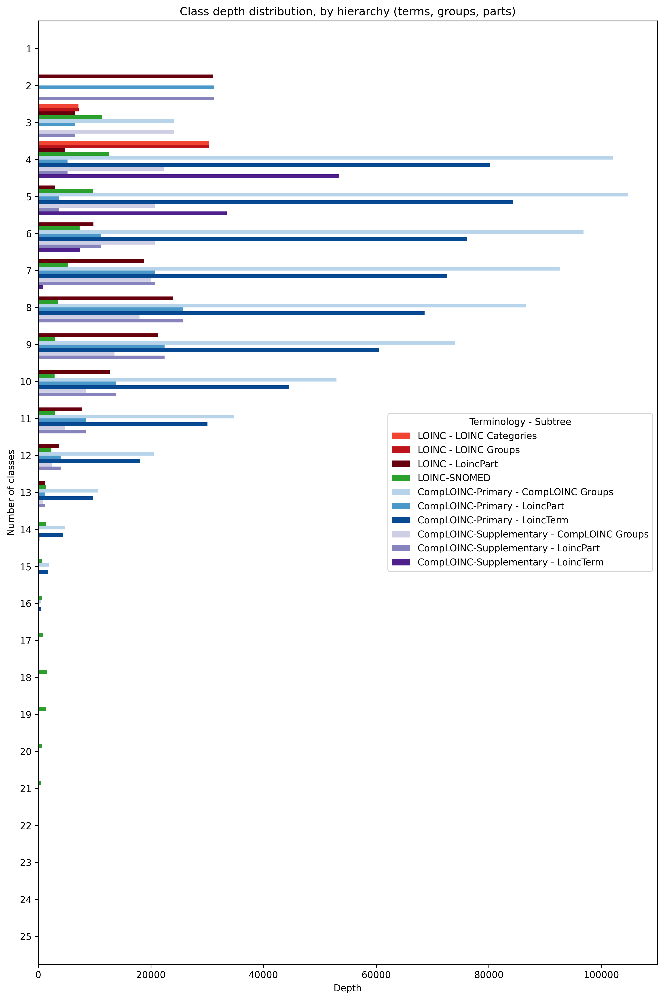

# *CompLOINC Statistics*

# Entities and axioms
## Entities and axiom counts
| Metric | Value |
| ------ | ----- |
| Annotation properties | 13 |
| Axioms | 1712225 |
| Logical axioms | 623404 |
| Classes | 241742 |
| Object properties | 56 |
| Data properties | 0 |
| Individuals | 0 |

## Axiom types
| Metric | Value |
| ------ | ----- |
| AnnotationAssertion | 847012 |
| EquivalentClasses | 125274 |
| SubObjectPropertyOf | 55 |
| Declaration | 241809 |
| SubClassOf | 498075 |

## Entity namespaces counts
| Metric | Value |
| ------ | ----- |
| prefix_unknown | 5891 |
| owl | 1 |
| rdf | 1 |
| COMPLOINC_GROUP | 24225 |
| rdfs | 1 |
| LOINC_PART | 116185 |
| LOINC_PROP | 47 |
| LOINC_TERM | 95452 |
| COMPLOINC_AXIOM | 9 |

## Axiom namespaces counts
| Metric | Value |
| ------ | ----- |
| prefix_unknown | 81370 |
| owl | 1923 |
| COMPLOINC_GROUP | 138297 |
| rdfs | 125550 |
| LOINC_PART | 1179773 |
| LOINC_PROP | 830392 |
| LOINC_TERM | 1501294 |
| COMPLOINC_AXIOM | 72 |

# Subclass axiom analysis
This analysis shows set totals, intersections, and differences for subclass axioms in LOINC, CompLOINC, and
LOINC-SNOMED Ontology. This includes both direct and indirect axioms, "direct" meaning a direct parent/child
relationship, as opposed to "indirect", meaning a 2+ degree ancestor/descendant relationship.

## Data preparation
The only subclass axioms that were removed were those containing anonymous class expressions (bnodes) within
LOINC-SNOMED Ontology.

## Total subclass axioms
| Terminology                         | n       |
|:------------------------------------|:--------|
| LOINC                               | 0       |
| LOINC-SNOMED                        | 290,693 |
| CompLOINC-all-Primary               | 370,410 |
| CompLOINC-all-Supplementary         | 569,385 |
| CompLOINC-LOINC-Primary             | 364,724 |
| CompLOINC-LOINC-Supplementary       | 563,919 |
| CompLOINC-LOINCSNOMED-Primary       | 7,078   |
| CompLOINC-LOINCSNOMED-Supplementary | 184,634 |

## Comparison: Upset plots
Horizontal bars represent the proportion of each terminology's subclass axioms relative to the total number of unique 
subclass axioms across all three resources. Vertical bars represent the proportion of subclass axioms belonging to 
specific combinations of terminology resources, with each column showing a distinct intersection pattern as indicated by
the connected dots below.

### SC axioms: All sources, simple comparison

| Intersection                                                       | Count   | Percentage   |
|:-------------------------------------------------------------------|:--------|:-------------|
| CompLOINC-all-Primary ∩ CompLOINC-all-Supplementary                | 352,984 | 40.4%        |
| LOINC-SNOMED                                                       | 289,127 | 33.1%        |
| CompLOINC-all-Supplementary                                        | 214,835 | 24.6%        |
| CompLOINC-all-Primary                                              | 15,860  | 1.8%         |
| LOINC-SNOMED ∩ CompLOINC-all-Primary ∩ CompLOINC-all-Supplementary | 1,566   | 0.2%         |

### SC axioms: LOINC-specific enhancements

| Intersection                                            | Count   | Percentage   |
|:--------------------------------------------------------|:--------|:-------------|
| CompLOINC-LOINC-Primary ∩ CompLOINC-LOINC-Supplementary | 349,118 | 60.2%        |
| CompLOINC-LOINC-Supplementary                           | 214,801 | 37.1%        |
| CompLOINC-LOINC-Primary                                 | 15,606  | 2.7%         |

### SC axioms: LOINC-SNOMED-specific enhancements

| Intersection                                                        | Count   | Percentage   |
|:--------------------------------------------------------------------|:--------|:-------------|
| LOINC-SNOMED                                                        | 290,693 | 61.0%        |
| CompLOINC-LOINCSNOMED-Supplementary                                 | 178,611 | 37.5%        |
| CompLOINC-LOINCSNOMED-Primary ∩ CompLOINC-LOINCSNOMED-Supplementary | 6,023   | 1.3%         |
| CompLOINC-LOINCSNOMED-Primary                                       | 1,055   | 0.2%         |

### SC axioms: All sources, with CompLOINC disaggregations, top 10

| Intersection                                                                                                                                                                        | Count   | Percentage   |
|:------------------------------------------------------------------------------------------------------------------------------------------------------------------------------------|:--------|:-------------|
| CompLOINC-all-Primary ∩ CompLOINC-all-Supplementary ∩ CompLOINC-LOINC-Primary ∩ CompLOINC-LOINC-Supplementary                                                                       | 342,308 | 39.1%        |
| LOINC-SNOMED                                                                                                                                                                        | 289,127 | 33.1%        |
| CompLOINC-all-Supplementary ∩ CompLOINC-LOINC-Supplementary ∩ CompLOINC-LOINCSNOMED-Supplementary                                                                                   | 177,817 | 20.3%        |
| CompLOINC-all-Supplementary ∩ CompLOINC-LOINC-Supplementary                                                                                                                         | 36,984  | 4.2%         |
| CompLOINC-all-Primary ∩ CompLOINC-LOINC-Primary                                                                                                                                     | 14,570  | 1.7%         |
| CompLOINC-all-Primary ∩ CompLOINC-all-Supplementary ∩ CompLOINC-LOINC-Primary ∩ CompLOINC-LOINC-Supplementary ∩ CompLOINC-LOINCSNOMED-Primary ∩ CompLOINC-LOINCSNOMED-Supplementary | 6,002   | 0.7%         |
| CompLOINC-all-Primary ∩ CompLOINC-all-Supplementary                                                                                                                                 | 3,849   | 0.4%         |
| LOINC-SNOMED ∩ CompLOINC-all-Primary ∩ CompLOINC-all-Supplementary                                                                                                                  | 1,566   | 0.2%         |
| CompLOINC-all-Primary ∩ CompLOINC-LOINC-Primary ∩ CompLOINC-LOINCSNOMED-Primary                                                                                                     | 1,034   | 0.1%         |
| CompLOINC-all-Primary ∩ CompLOINC-all-Supplementary ∩ CompLOINC-LOINC-Primary ∩ CompLOINC-LOINC-Supplementary ∩ CompLOINC-LOINCSNOMED-Supplementary                                 | 793     | 0.1%         |

## Comparison: Merged tables
The following table only applies to the "All sources, simple comparison" variation. The other upset plot / intersection
analysis variations are not represented.

Cell formatting: (%intersection/a) / (n intersection) / (%intersection/b)

Where 'a' is the ontology represented by the row, and 'b' is the ontology represented by the column. 'n intersection' is
the total number of subclass axioms in the intersection of the two ontologies. '%intersection/' is the percentage of
subclass axioms in the intersection of the two ontologies, relative to the total number of subclass axioms in the
ontology.

|                             | LOINC           | LOINC-SNOMED        | CompLOINC-all-Primary   | CompLOINC-all-Supplementary   |
|:----------------------------|:----------------|:--------------------|:------------------------|:------------------------------|
| LOINC                       | -               | 0.0% / 0 / 0.0%     | 0.0% / 0 / 0.0%         | 0.0% / 0 / 0.0%               |
| LOINC-SNOMED                | 0.0% / 0 / 0.0% | -                   | 0.5% / 1,566 / 0.4%     | 0.5% / 1,566 / 0.3%           |
| CompLOINC-all-Primary       | 0.0% / 0 / 0.0% | 0.4% / 1,566 / 0.5% | -                       | 95.7% / 354,550 / 62.3%       |
| CompLOINC-all-Supplementary | 0.0% / 0 / 0.0% | 0.3% / 1,566 / 0.5% | 62.3% / 354,550 / 95.7% | -                             |

## Comparison: Individual tables
The following table only applies to the "All sources, simple comparison" variation. The other upset plot / intersection
analysis variations are not represented.

Meaning of table headers:

"a vs b": 'a' is the ontology on the left side of the comparison, and 'b' is the one on the right side.
- **tot a**: Total number of subclass axioms for ontology on left side of the comparison.
- **% (a-b)**: The percentage of "a - b" (the set difference of a and b) over the total number of axioms in a.
- **n (a-b)**: Total number of subclass axioms in the set difference of a and b.
- **intersection**: The length of the intersection
- **tot b**: Total number of subclass axioms for ontology on left side of the comparison.
- **n (b-a)**: Total number of subclass axioms in the set difference of b and a.
- **% (b-a)**: The percentage of "b - a" (the set difference of b and a) over the total number of axioms in b.

### LOINC

#### vs LOINC-SNOMED

| % (a-b)   |   n (a-b) |   tot a |   intersection |   tot b |   n (b-a) | % (b-a)   |
|:----------|----------:|--------:|---------------:|--------:|----------:|:----------|
| 0.0%      |         0 |       0 |              0 |  290693 |    290693 | 100.0%    |

#### vs CompLOINC-all-Primary

| % (a-b)   |   n (a-b) |   tot a |   intersection |   tot b |   n (b-a) | % (b-a)   |
|:----------|----------:|--------:|---------------:|--------:|----------:|:----------|
| 0.0%      |         0 |       0 |              0 |  370410 |    370410 | 100.0%    |

#### vs CompLOINC-all-Supplementary

| % (a-b)   |   n (a-b) |   tot a |   intersection |   tot b |   n (b-a) | % (b-a)   |
|:----------|----------:|--------:|---------------:|--------:|----------:|:----------|
| 0.0%      |         0 |       0 |              0 |  569385 |    569385 | 100.0%    |

### LOINC-SNOMED

#### vs LOINC

| % (a-b)   |   n (a-b) |   tot a |   intersection |   tot b |   n (b-a) | % (b-a)   |
|:----------|----------:|--------:|---------------:|--------:|----------:|:----------|
| 100.0%    |    290693 |  290693 |              0 |       0 |         0 | 0.0%      |

#### vs CompLOINC-all-Primary

| % (a-b)   |   n (a-b) |   tot a |   intersection |   tot b |   n (b-a) | % (b-a)   |
|:----------|----------:|--------:|---------------:|--------:|----------:|:----------|
| 99.5%     |    289127 |  290693 |           1566 |  370410 |    368844 | 99.6%     |

#### vs CompLOINC-all-Supplementary

| % (a-b)   |   n (a-b) |   tot a |   intersection |   tot b |   n (b-a) | % (b-a)   |
|:----------|----------:|--------:|---------------:|--------:|----------:|:----------|
| 99.5%     |    289127 |  290693 |           1566 |  569385 |    567819 | 99.7%     |

### CompLOINC-all-Primary

#### vs LOINC

| % (a-b)   |   n (a-b) |   tot a |   intersection |   tot b |   n (b-a) | % (b-a)   |
|:----------|----------:|--------:|---------------:|--------:|----------:|:----------|
| 100.0%    |    370410 |  370410 |              0 |       0 |         0 | 0.0%      |

#### vs LOINC-SNOMED

| % (a-b)   |   n (a-b) |   tot a |   intersection |   tot b |   n (b-a) | % (b-a)   |
|:----------|----------:|--------:|---------------:|--------:|----------:|:----------|
| 99.6%     |    368844 |  370410 |           1566 |  290693 |    289127 | 99.5%     |

#### vs CompLOINC-all-Supplementary

| % (a-b)   |   n (a-b) |   tot a |   intersection |   tot b |   n (b-a) | % (b-a)   |
|:----------|----------:|--------:|---------------:|--------:|----------:|:----------|
| 4.3%      |     15860 |  370410 |         354550 |  569385 |    214835 | 37.7%     |

### CompLOINC-all-Supplementary

#### vs LOINC

| % (a-b)   |   n (a-b) |   tot a |   intersection |   tot b |   n (b-a) | % (b-a)   |
|:----------|----------:|--------:|---------------:|--------:|----------:|:----------|
| 100.0%    |    569385 |  569385 |              0 |       0 |         0 | 0.0%      |

#### vs LOINC-SNOMED

| % (a-b)   |   n (a-b) |   tot a |   intersection |   tot b |   n (b-a) | % (b-a)   |
|:----------|----------:|--------:|---------------:|--------:|----------:|:----------|
| 99.7%     |    567819 |  569385 |           1566 |  290693 |    289127 | 99.5%     |

#### vs CompLOINC-all-Primary

| % (a-b)   |   n (a-b) |   tot a |   intersection |   tot b |   n (b-a) | % (b-a)   |
|:----------|----------:|--------:|---------------:|--------:|----------:|:----------|
| 37.7%     |    214835 |  569385 |         354550 |  370410 |     15860 | 4.3%      |

# Dangling part terms
These are parts that do not fall in the hierarchy in LOINC, but for which CompLOINC attempts to incorporate.

Similarity threshold: 0.5

| Part | n | Percentage |
|----------|-------|------------|
| All parts | 72740 | 100% |
| Non-dangling | 53861 | 74.0% |
| Dangling | 18879 | 26.0% |
| (Dangling >= threshold) / dangling | 12099 | 64.1% |
| (Dangling >= threshold) / all | 12099 | 16.6% |
# Classification depth analysis 
This measures how deep into the hierarchy each class is. E.g. if the root of the hierarchy is TermA, and we have axioms
(TermC subClassOf TermB) and (TermB subClassOf TermA), then TermC is at depth 3, TermB is at depth 2, and TermA is at 
depth 1.

## Web application: https://comp-loinc.onrender.com/
Can take ~5 minutes to load when asleep. Sleeps when unused for 15 minutes. Contains interactive variations of these 
plots.

## Polyhierarchies
**Impact on class depths**  
CompLOINC and the LOINC and LOINC-SNOMED representations are all polyhierarchies. This means that classes can appear 
multiple times. For this analysis, we have decided to include every occurrence of a class in the counts. For example, if
a class appears in 3 subtrees, once at depth 3, and in two subtrees at depth 2, this class will be tallied twice at 
depth 2, and once at depth 3. 

**Disaggregating major subtrees**  
CompLOINC and LOINC have more than 1 top-level branches (AKA subhierarchies or subtrees).

| Terminology | Hierarchy name   | Root URI                        |
|-------------|------------------|---------------------------------|
| CompLOINC   | SNOMED-Inspired  | https://loinc.org/138875005     |
| CompLOINC   | LoincTerm        | https://loinc.org/LoincTerm     |
| CompLOINC   | CompLOINC Groups | https://comploinc/group          |
| CompLOINC   | LoincPart        | https://loinc.org/LoincPart     |
| LOINC       | LOINC Categories | https://loinc.org/LoincCategory |
| LOINC       | LOINC Groups     | https://loinc.org/LoincGroup    |
| LOINC       | LoincPart        | https://loinc.org/LoincPart     |

Note, by subtree:
- *SNOMED-Inspired*: This is inspired largely by the LOINC-SNOMED Ontology.
- *LoincTerm*: LOINC has no Term hierarchy. It has a part hierarchy in the tree browser (https://loinc.org/tree/), which 
has parts as leaves. CompLOINC has a term hierarchy based on inference, combining the part hierarchy from the tree 
browser with supplementary or primary part model definitions.
- *LoincPart*: Exists in the LOINC tree browser, but not the official LOINC release. CompLOINC includes it as an 
optional subtree, largely obtained.
- *LOINC Groups*: Part of the LOINC release. See more: https://loinc.org/groups/. Terms are grouped, and some groups 
have groups. Also just for this analysis, we have added a single, novel https://loinc.org/LoincGroup root as a parent of
the otherwise top level groups in the LOINC release.
- *LOINC Categories*: Part of  the LOINC release, but not as formal as LOINC groups. These categories have no URIs, just 
labels. They are parents only of groups, not terms. From https://loinc.org/groups/: 'Category: A short description that 
identifies the general purpose of the group, such as "Flowsheet", "Reportable microbiology" or "Document ontology 
grouped by role and subject matter domain".'
- *CompLOINC Groups*: CompLOINC has a novel grouping class hierarchy. It does not utilize LOINC groups or categories in 
the LOINC release. The top level class is "https://comploinc/group", followed by a major group branch for each "property 
axis" (that is, a single part property or combination thereof), e.g. "https://comploinc/group/component/". Then, groups 
which are defined via these properties descend from there. 

**Two sets of outputs**  
In many cases, the best way to use each of these is not to use the entire polyhierarchy, but individual major subtrees. 
As such, we have produced a set of "by hierarchy" outputs, where these major subtrees have been disaggregated. The other
set of outputs aggregates all of the subtrees together in its counts. 

## Class types
We consider the following 3 types of classes: terms, parts, and groups. There are 3 sets of outputs with respect to 
class types: terms only, terms+groups, and terms+groups+parts.

There are also different kinds of possible axioms in CompLOINC, LOINC, and LOINC-SNOMED Ontology, with respect to class 
types.  

Homogeneous
- term --> term
- part --> part
- group --> group

Heterogeneous
- term --> part
- part --> term
- term --> group
- group --> term
- part --> group
- group --> part 

For a given filter of class type, we discard any subclass axioms where either the parent or child is not included. So, 
for example if we are only looking at 'terms', we only consider the term-->term axioms. If we are looking at 
'terms+groups', we retain axioms for term-->term, group-->group, term-->group, and group-->term.

## Dangling classes  
Dangling classes are not represented here in this class depth analysis.

**Ramifications for CompLOINC**  
The only dangling classes in CompLOINC are dangling parts from the LOINC release, specifically the ones which CompLOINC 
was not able to find matches. Those classes are not represented here.

**Ramifications for LOINC representation**  
Note that this results in LOINC showing that it has 0 terms at any depths, as LOINC has no term hierarchy. The only 
hierarchies that exist in LOINC are a shallow grouping hierarchy (represented by CSVs in `AccessoryFiles/GroupFile/` in 
the LOINC release, and the part hierarchy, which is not represented in the release, but only exists in the LOINC tree 
browser (https://loinc.org/tree/). Regarding parts, there are also a large number of those that are dangling even after 
when considering all of the tree browser hierarchies, and those as well are not represented here. 

**Dangling subtrees**  
There is also the case where, as a result of filtering class types, there end up being dangling sub-trees. For example, 
it could be that somewhere in a hierarchy, there is a term-group axiom, which is the root of its own subtree. If we are 
filtering to show terms only, then this axiom gets removed, leaving its descendants (subtree) dangling. This subtree may
contain term-term axioms, which would otherwise be kept, but since they are part of a dangling subtree, they are 
removed. 

## CompLOINC representation
**Grouping class depths adjusted via synthetic "master grouping classes"**  
This particular analysis makes small modifications to the CompLOINC representation with respect to groups. In the 
CompLOINC .owl artefacts, there are many top-level grouping classes at the root of the ontology. These top level 
grouping classes come in various sets, one for each LOINC property or combination of properties used to construct the 
groups. For example, the grouping class https://comploinc/group/component/LP16066-0 falls under the "component" property 
axis, while the grouping class https://comploinc/group/component-system/LP7795-0-LP310005-6 falls under the 
"component+system" property (combination) axis. If these parts for these properties have no parents, then these grouping
classes will reside at the root of CompLOINC. However, for these classification depth analyses, we are comparing against 
other subtrees that have a single root, e.g. LoincPart or LoincTerm. Therefore, for the depths to be consistent along 
class types (terms, parts, groups), we have included "master grouping classes" just for this analysis. The top level for
all grouping classes is https://comploinc/group/ ("GRP"), and the children of this class are all of the roots of each 
property axis, e.g. https://comploinc/group/component/ ("GRP_CMP"),
https://comploinc/group/component-system/ ("GRP_SYS"), and so on.

## LOINC representation
LOINC itself does not have an `.owl` representation, but for this analysis we constructed one. The following are some 
caveats about the representation, by class type.

**Terms**  
LOINC defines no term-term subclass relationships. It only defines term-group relationships. Therefore, for the analyses 
where we consider only terms, the term-group subclass axioms are intentionally dropped, resulting in no axioms at all, 
and therefore rendering LOINC to show 0 classes at any depth.  

**Parts**  
Some variations of the outputs include part classes. The LOINC release does not establish part-part subclass 
relationships. These relationships are obtained by exports from the LOINC tree browser: https://loinc.org/tree/.

**Groups**  
Some variations of the outputs include parts group classes. While the LOINC release does not have term-term or part-part
subclass axioms, it does have such "axioms" for group-group and term-group. `Group.csv`: Defines relationships between 
groups and parent groups. `GroupLoincTerms.csv`: Defines relationships between terms (`LoincNumber` column) and groups 
(`GroupId` column). Also defines relationships between categories (`Category` column) and groups/terms. For this 
analysis, we consider categories to be just another kind of group. This results in our representation of LOINC groups 
being a polyhierarchy, as terms and groups can fall under other groups, but also can fall under categories. Thus, such 
terms and groups will be counted multiple times in the depths counts. 

More information about LOINC groups can be found here: https://loinc.org/groups/

## LOINC-SNOMED Ontology representation
This representation is used not only for class depth analysis, but also for subclass axiom intersection analysis. In 
order to do these analyses, we also rendered LOINC-SNOMED Ontology in OWL. We did this by utilizing the 
`OWLExpressionSnapshot` files in each of the SNOMED and LOINC-SNOMED RF2 (Release Format 2) releases. This was done 
essentially by taking all of the values in the `owlExpression` column and placing them in a new `.owl` file, then 
wrapping it in an ontology tag, and adding a header with prefix tags.

After converting the whole of SNOMED to OWL, and the LOINC-SNOMED Ontology module to OWL, we then extracted the relevant
ancestor closure from SNOMED for the set of ancestors in LOINC-SNOMED. We then merged that closure with the LOINC-SNOMED
module, and finally reasoned using `robot reason` (default reasoner = ELK).  

---

## Number of classes (terms)

|   Depth |   LOINC | LOINC-SNOMED   | CompLOINC-Primary   | CompLOINC-Supplementary   |
|---------|---------|----------------|---------------------|---------------------------|
|       1 |       0 | 1              | 1                   | 1                         |
|       2 |       0 | 12             | 4                   | 4                         |
|       3 |       0 | 11,367         | 88                  | 88                        |
|       4 |       0 | 12,546         | 50,791              | 53,488                    |
|       5 |       0 | 9,786          | 37,483              | 33,444                    |
|       6 |       0 | 7,356          | 8,431               | 7,403                     |
|       7 |       0 | 5,323          | 1,286               | 932                       |
|       8 |       0 | 3,528          | 187                 | 130                       |
|       9 |       0 | 2,945          | 7                   | 3                         |
|      10 |       0 | 2,911          | 0                   | 0                         |
|      11 |       0 | 2,950          | 0                   | 0                         |
|      12 |       0 | 2,362          | 0                   | 0                         |
|      13 |       0 | 1,359          | 0                   | 0                         |
|      14 |       0 | 1,383          | 0                   | 0                         |
|      15 |       0 | 697            | 0                   | 0                         |
|      16 |       0 | 693            | 0                   | 0                         |
|      17 |       0 | 925            | 0                   | 0                         |
|      18 |       0 | 1,550          | 0                   | 0                         |
|      19 |       0 | 1,326          | 0                   | 0                         |
|      20 |       0 | 716            | 0                   | 0                         |
|      21 |       0 | 496            | 0                   | 0                         |
|      22 |       0 | 57             | 0                   | 0                         |
|      23 |       0 | 9              | 0                   | 0                         |
|      24 |       0 | 2              | 0                   | 0                         |
|      25 |       0 | 1              | 0                   | 0                         |

## % of classes (terms)

|   Depth |   LOINC |   LOINC-SNOMED |   CompLOINC-Primary |   CompLOINC-Supplementary |
|---------|---------|----------------|---------------------|---------------------------|
|       1 |       0 |         0.0014 |              0.001  |                    0.001  |
|       2 |       0 |         0.017  |              0.0041 |                    0.0042 |
|       3 |       0 |        16      |              0.09   |                    0.092  |
|       4 |       0 |        18      |             52      |                   56      |
|       5 |       0 |        14      |             38      |                   35      |
|       6 |       0 |        10      |              8.6    |                    7.8    |
|       7 |       0 |         7.6    |              1.3    |                    0.98   |
|       8 |       0 |         5      |              0.19   |                    0.14   |
|       9 |       0 |         4.2    |              0.0071 |                    0.0031 |
|      10 |       0 |         4.1    |              0      |                    0      |
|      11 |       0 |         4.2    |              0      |                    0      |
|      12 |       0 |         3.4    |              0      |                    0      |
|      13 |       0 |         1.9    |              0      |                    0      |
|      14 |       0 |         2      |              0      |                    0      |
|      15 |       0 |         0.99   |              0      |                    0      |
|      16 |       0 |         0.99   |              0      |                    0      |
|      17 |       0 |         1.3    |              0      |                    0      |
|      18 |       0 |         2.2    |              0      |                    0      |
|      19 |       0 |         1.9    |              0      |                    0      |
|      20 |       0 |         1      |              0      |                    0      |
|      21 |       0 |         0.71   |              0      |                    0      |
|      22 |       0 |         0.081  |              0      |                    0      |
|      23 |       0 |         0.013  |              0      |                    0      |
|      24 |       0 |         0.0028 |              0      |                    0      |
|      25 |       0 |         0.0014 |              0      |                    0      |

## Number of classes (terms), by hierarchy

|   Depth |   LOINC | LOINC-SNOMED   | CompLOINC-Primary   | CompLOINC-Supplementary   |
|---------|---------|----------------|---------------------|---------------------------|
|       1 |       0 | 1              | 1                   | 1                         |
|       2 |       0 | 12             | 4                   | 4                         |
|       3 |       0 | 11,367         | 88                  | 88                        |
|       4 |       0 | 12,546         | 50,791              | 53,488                    |
|       5 |       0 | 9,786          | 37,483              | 33,444                    |
|       6 |       0 | 7,356          | 8,431               | 7,403                     |
|       7 |       0 | 5,323          | 1,286               | 932                       |
|       8 |       0 | 3,528          | 187                 | 130                       |
|       9 |       0 | 2,945          | 7                   | 3                         |
|      10 |       0 | 2,911          | 0                   | 0                         |
|      11 |       0 | 2,950          | 0                   | 0                         |
|      12 |       0 | 2,362          | 0                   | 0                         |
|      13 |       0 | 1,359          | 0                   | 0                         |
|      14 |       0 | 1,383          | 0                   | 0                         |
|      15 |       0 | 697            | 0                   | 0                         |
|      16 |       0 | 693            | 0                   | 0                         |
|      17 |       0 | 925            | 0                   | 0                         |
|      18 |       0 | 1,550          | 0                   | 0                         |
|      19 |       0 | 1,326          | 0                   | 0                         |
|      20 |       0 | 716            | 0                   | 0                         |
|      21 |       0 | 496            | 0                   | 0                         |
|      22 |       0 | 57             | 0                   | 0                         |
|      23 |       0 | 9              | 0                   | 0                         |
|      24 |       0 | 2              | 0                   | 0                         |
|      25 |       0 | 1              | 0                   | 0                         |

## % of classes (terms), by hierarchy

|   Depth |   LOINC |   LOINC-SNOMED |   CompLOINC-Primary |   CompLOINC-Supplementary |
|---------|---------|----------------|---------------------|---------------------------|
|       1 |       0 |         0.0014 |              0.001  |                    0.001  |
|       2 |       0 |         0.017  |              0.0041 |                    0.0042 |
|       3 |       0 |        16      |              0.09   |                    0.092  |
|       4 |       0 |        18      |             52      |                   56      |
|       5 |       0 |        14      |             38      |                   35      |
|       6 |       0 |        10      |              8.6    |                    7.8    |
|       7 |       0 |         7.6    |              1.3    |                    0.98   |
|       8 |       0 |         5      |              0.19   |                    0.14   |
|       9 |       0 |         4.2    |              0.0071 |                    0.0031 |
|      10 |       0 |         4.1    |              0      |                    0      |
|      11 |       0 |         4.2    |              0      |                    0      |
|      12 |       0 |         3.4    |              0      |                    0      |
|      13 |       0 |         1.9    |              0      |                    0      |
|      14 |       0 |         2      |              0      |                    0      |
|      15 |       0 |         0.99   |              0      |                    0      |
|      16 |       0 |         0.99   |              0      |                    0      |
|      17 |       0 |         1.3    |              0      |                    0      |
|      18 |       0 |         2.2    |              0      |                    0      |
|      19 |       0 |         1.9    |              0      |                    0      |
|      20 |       0 |         1      |              0      |                    0      |
|      21 |       0 |         0.71   |              0      |                    0      |
|      22 |       0 |         0.081  |              0      |                    0      |
|      23 |       0 |         0.013  |              0      |                    0      |
|      24 |       0 |         0.0028 |              0      |                    0      |
|      25 |       0 |         0.0014 |              0      |                    0      |

## Number of classes (terms, groups)

|   Depth | LOINC   | LOINC-SNOMED   | CompLOINC-Primary   | CompLOINC-Supplementary   |
|---------|---------|----------------|---------------------|---------------------------|
|       1 | 2       | 1              | 2                   | 2                         |
|       2 | 61      | 12             | 7                   | 7                         |
|       3 | 7,168   | 11,367         | 24,221              | 24,215                    |
|       4 | 30,327  | 12,546         | 102,469             | 75,792                    |
|       5 | 0       | 9,786          | 105,077             | 54,230                    |
|       6 | 0       | 7,356          | 96,840              | 28,084                    |
|       7 | 0       | 5,323          | 92,577              | 20,922                    |
|       8 | 0       | 3,528          | 86,556              | 18,102                    |
|       9 | 0       | 2,945          | 74,026              | 13,524                    |
|      10 | 0       | 2,911          | 52,943              | 8,412                     |
|      11 | 0       | 2,950          | 34,786              | 4,731                     |
|      12 | 0       | 2,362          | 20,512              | 2,383                     |
|      13 | 0       | 1,359          | 10,617              | 900                       |
|      14 | 0       | 1,383          | 4,725               | 309                       |
|      15 | 0       | 697            | 1,858               | 51                        |
|      16 | 0       | 693            | 488                 | 0                         |
|      17 | 0       | 925            | 72                  | 0                         |
|      18 | 0       | 1,550          | 1                   | 0                         |
|      19 | 0       | 1,326          | 0                   | 0                         |
|      20 | 0       | 716            | 0                   | 0                         |
|      21 | 0       | 496            | 0                   | 0                         |
|      22 | 0       | 57             | 0                   | 0                         |
|      23 | 0       | 9              | 0                   | 0                         |
|      24 | 0       | 2              | 0                   | 0                         |
|      25 | 0       | 1              | 0                   | 0                         |

## % of classes (terms, groups)

|   Depth |   LOINC |   LOINC-SNOMED |   CompLOINC-Primary |   CompLOINC-Supplementary |
|---------|---------|----------------|---------------------|---------------------------|
|       1 |  0.0053 |         0.0014 |             0.00028 |                   0.00079 |
|       2 |  0.16   |         0.017  |             0.00099 |                   0.0028  |
|       3 | 19      |        16      |             3.4     |                   9.6     |
|       4 | 81      |        18      |            14       |                  30       |
|       5 |  0      |        14      |            15       |                  22       |
|       6 |  0      |        10      |            14       |                  11       |
|       7 |  0      |         7.6    |            13       |                   8.3     |
|       8 |  0      |         5      |            12       |                   7.2     |
|       9 |  0      |         4.2    |            10       |                   5.4     |
|      10 |  0      |         4.1    |             7.5     |                   3.3     |
|      11 |  0      |         4.2    |             4.9     |                   1.9     |
|      12 |  0      |         3.4    |             2.9     |                   0.95    |
|      13 |  0      |         1.9    |             1.5     |                   0.36    |
|      14 |  0      |         2      |             0.67    |                   0.12    |
|      15 |  0      |         0.99   |             0.26    |                   0.02    |
|      16 |  0      |         0.99   |             0.069   |                   0       |
|      17 |  0      |         1.3    |             0.01    |                   0       |
|      18 |  0      |         2.2    |             0.00014 |                   0       |
|      19 |  0      |         1.9    |             0       |                   0       |
|      20 |  0      |         1      |             0       |                   0       |
|      21 |  0      |         0.71   |             0       |                   0       |
|      22 |  0      |         0.081  |             0       |                   0       |
|      23 |  0      |         0.013  |             0       |                   0       |
|      24 |  0      |         0.0028 |             0       |                   0       |
|      25 |  0      |         0.0014 |             0       |                   0       |

## Number of classes (terms, groups), by hierarchy

|   Depth | LOINC - LOINC Categories   | LOINC - LOINC Groups   | LOINC-SNOMED   | CompLOINC-Primary - CompLOINC Groups   | CompLOINC-Primary - LoincTerm   | CompLOINC-Supplementary - CompLOINC Groups   | CompLOINC-Supplementary - LoincTerm   |
|---------|----------------------------|------------------------|----------------|----------------------------------------|---------------------------------|----------------------------------------------|---------------------------------------|
|       1 | 1                          | 1                      | 1              | 1                                      | 1                               | 1                                            | 1                                     |
|       2 | 16                         | 45                     | 12             | 3                                      | 4                               | 3                                            | 4                                     |
|       3 | 7,130                      | 7,168                  | 11,367         | 24,133                                 | 88                              | 24,127                                       | 88                                    |
|       4 | 30,327                     | 30,327                 | 12,546         | 102,085                                | 80,165                          | 22,304                                       | 53,488                                |
|       5 | 0                          | 0                      | 9,786          | 104,683                                | 84,291                          | 20,786                                       | 33,444                                |
|       6 | 0                          | 0                      | 7,356          | 96,797                                 | 76,159                          | 20,681                                       | 7,403                                 |
|       7 | 0                          | 0                      | 5,323          | 92,575                                 | 72,587                          | 19,990                                       | 932                                   |
|       8 | 0                          | 0                      | 3,528          | 86,556                                 | 68,584                          | 17,972                                       | 130                                   |
|       9 | 0                          | 0                      | 2,945          | 74,026                                 | 60,505                          | 13,521                                       | 3                                     |
|      10 | 0                          | 0                      | 2,911          | 52,943                                 | 44,531                          | 8,412                                        | 0                                     |
|      11 | 0                          | 0                      | 2,950          | 34,786                                 | 30,055                          | 4,731                                        | 0                                     |
|      12 | 0                          | 0                      | 2,362          | 20,512                                 | 18,129                          | 2,383                                        | 0                                     |
|      13 | 0                          | 0                      | 1,359          | 10,617                                 | 9,717                           | 900                                          | 0                                     |
|      14 | 0                          | 0                      | 1,383          | 4,725                                  | 4,416                           | 309                                          | 0                                     |
|      15 | 0                          | 0                      | 697            | 1,858                                  | 1,807                           | 51                                           | 0                                     |
|      16 | 0                          | 0                      | 693            | 488                                    | 488                             | 0                                            | 0                                     |
|      17 | 0                          | 0                      | 925            | 72                                     | 72                              | 0                                            | 0                                     |
|      18 | 0                          | 0                      | 1,550          | 1                                      | 1                               | 0                                            | 0                                     |
|      19 | 0                          | 0                      | 1,326          | 0                                      | 0                               | 0                                            | 0                                     |
|      20 | 0                          | 0                      | 716            | 0                                      | 0                               | 0                                            | 0                                     |
|      21 | 0                          | 0                      | 496            | 0                                      | 0                               | 0                                            | 0                                     |
|      22 | 0                          | 0                      | 57             | 0                                      | 0                               | 0                                            | 0                                     |
|      23 | 0                          | 0                      | 9              | 0                                      | 0                               | 0                                            | 0                                     |
|      24 | 0                          | 0                      | 2              | 0                                      | 0                               | 0                                            | 0                                     |
|      25 | 0                          | 0                      | 1              | 0                                      | 0                               | 0                                            | 0                                     |

## % of classes (terms, groups), by hierarchy

|   Depth |   LOINC - LOINC Categories |   LOINC - LOINC Groups |   LOINC-SNOMED |   CompLOINC-Primary - CompLOINC Groups |   CompLOINC-Primary - LoincTerm |   CompLOINC-Supplementary - CompLOINC Groups |   CompLOINC-Supplementary - LoincTerm |
|---------|----------------------------|------------------------|----------------|----------------------------------------|---------------------------------|----------------------------------------------|---------------------------------------|
|       1 |                     0.0027 |                 0.0027 |         0.0014 |                                0.00014 |                         0.00018 |                                      0.00064 |                                0.001  |
|       2 |                     0.043  |                 0.12   |         0.017  |                                0.00042 |                         0.00073 |                                      0.0019  |                                0.0042 |
|       3 |                    19      |                19      |        16      |                                3.4     |                         0.016   |                                     15       |                                0.092  |
|       4 |                    81      |                81      |        18      |                               14       |                        15       |                                     14       |                               56      |
|       5 |                     0      |                 0      |        14      |                               15       |                        15       |                                     13       |                               35      |
|       6 |                     0      |                 0      |        10      |                               14       |                        14       |                                     13       |                                7.8    |
|       7 |                     0      |                 0      |         7.6    |                               13       |                        13       |                                     13       |                                0.98   |
|       8 |                     0      |                 0      |         5      |                               12       |                        12       |                                     12       |                                0.14   |
|       9 |                     0      |                 0      |         4.2    |                               10       |                        11       |                                      8.7     |                                0.0031 |
|      10 |                     0      |                 0      |         4.1    |                                7.5     |                         8.1     |                                      5.4     |                                0      |
|      11 |                     0      |                 0      |         4.2    |                                4.9     |                         5.4     |                                      3       |                                0      |
|      12 |                     0      |                 0      |         3.4    |                                2.9     |                         3.3     |                                      1.5     |                                0      |
|      13 |                     0      |                 0      |         1.9    |                                1.5     |                         1.8     |                                      0.58    |                                0      |
|      14 |                     0      |                 0      |         2      |                                0.67    |                         0.8     |                                      0.2     |                                0      |
|      15 |                     0      |                 0      |         0.99   |                                0.26    |                         0.33    |                                      0.033   |                                0      |
|      16 |                     0      |                 0      |         0.99   |                                0.069   |                         0.088   |                                      0       |                                0      |
|      17 |                     0      |                 0      |         1.3    |                                0.01    |                         0.013   |                                      0       |                                0      |
|      18 |                     0      |                 0      |         2.2    |                                0.00014 |                         0.00018 |                                      0       |                                0      |
|      19 |                     0      |                 0      |         1.9    |                                0       |                         0       |                                      0       |                                0      |
|      20 |                     0      |                 0      |         1      |                                0       |                         0       |                                      0       |                                0      |
|      21 |                     0      |                 0      |         0.71   |                                0       |                         0       |                                      0       |                                0      |
|      22 |                     0      |                 0      |         0.081  |                                0       |                         0       |                                      0       |                                0      |
|      23 |                     0      |                 0      |         0.013  |                                0       |                         0       |                                      0       |                                0      |
|      24 |                     0      |                 0      |         0.0028 |                                0       |                         0       |                                      0       |                                0      |
|      25 |                     0      |                 0      |         0.0014 |                                0       |                         0       |                                      0       |                                0      |

## Number of classes (terms, groups, parts)

|   Depth | LOINC   | LOINC-SNOMED   | CompLOINC-Primary   | CompLOINC-Supplementary   |
|---------|---------|----------------|---------------------|---------------------------|
|       1 | 3       | 1              | 3                   | 3                         |
|       2 | 31,022  | 12             | 31,269              | 31,269                    |
|       3 | 13,639  | 11,367         | 30,744              | 30,738                    |
|       4 | 35,075  | 12,546         | 107,665             | 80,988                    |
|       5 | 2,995   | 9,786          | 108,799             | 57,952                    |
|       6 | 9,792   | 7,356          | 108,008             | 39,252                    |
|       7 | 18,805  | 5,323          | 113,339             | 41,684                    |
|       8 | 23,995  | 3,528          | 112,272             | 43,818                    |
|       9 | 21,244  | 2,945          | 96,473              | 35,971                    |
|      10 | 12,690  | 2,911          | 66,772              | 22,241                    |
|      11 | 7,684   | 2,950          | 43,202              | 13,147                    |
|      12 | 3,634   | 2,362          | 24,495              | 6,366                     |
|      13 | 1,192   | 1,359          | 11,856              | 2,139                     |
|      14 | 134     | 1,383          | 4,861               | 445                       |
|      15 | 10      | 697            | 1,868               | 61                        |
|      16 | 0       | 693            | 488                 | 0                         |
|      17 | 0       | 925            | 72                  | 0                         |
|      18 | 0       | 1,550          | 1                   | 0                         |
|      19 | 0       | 1,326          | 0                   | 0                         |
|      20 | 0       | 716            | 0                   | 0                         |
|      21 | 0       | 496            | 0                   | 0                         |
|      22 | 0       | 57             | 0                   | 0                         |
|      23 | 0       | 9              | 0                   | 0                         |
|      24 | 0       | 2              | 0                   | 0                         |
|      25 | 0       | 1              | 0                   | 0                         |

## % of classes (terms, groups, parts)

|   Depth |   LOINC |   LOINC-SNOMED |   CompLOINC-Primary |   CompLOINC-Supplementary |
|---------|---------|----------------|---------------------|---------------------------|
|       1 |  0.0016 |         0.0014 |             0.00035 |                   0.00074 |
|       2 | 17      |         0.017  |             3.6     |                   7.7     |
|       3 |  7.5    |        16      |             3.6     |                   7.6     |
|       4 | 19      |        18      |            12       |                  20       |
|       5 |  1.6    |        14      |            13       |                  14       |
|       6 |  5.4    |        10      |            13       |                   9.7     |
|       7 | 10      |         7.6    |            13       |                  10       |
|       8 | 13      |         5      |            13       |                  11       |
|       9 | 12      |         4.2    |            11       |                   8.9     |
|      10 |  7      |         4.1    |             7.7     |                   5.5     |
|      11 |  4.2    |         4.2    |             5       |                   3.2     |
|      12 |  2      |         3.4    |             2.8     |                   1.6     |
|      13 |  0.66   |         1.9    |             1.4     |                   0.53    |
|      14 |  0.074  |         2      |             0.56    |                   0.11    |
|      15 |  0.0055 |         0.99   |             0.22    |                   0.015   |
|      16 |  0      |         0.99   |             0.057   |                   0       |
|      17 |  0      |         1.3    |             0.0084  |                   0       |
|      18 |  0      |         2.2    |             0.00012 |                   0       |
|      19 |  0      |         1.9    |             0       |                   0       |
|      20 |  0      |         1      |             0       |                   0       |
|      21 |  0      |         0.71   |             0       |                   0       |
|      22 |  0      |         0.081  |             0       |                   0       |
|      23 |  0      |         0.013  |             0       |                   0       |
|      24 |  0      |         0.0028 |             0       |                   0       |
|      25 |  0      |         0.0014 |             0       |                   0       |

## Number of classes (terms, groups, parts), by hierarchy

|   Depth | LOINC - LOINC Categories   | LOINC - LOINC Groups   | LOINC - LoincPart   | LOINC-SNOMED   | CompLOINC-Primary - CompLOINC Groups   | CompLOINC-Primary - LoincPart   | CompLOINC-Primary - LoincTerm   | CompLOINC-Supplementary - CompLOINC Groups   | CompLOINC-Supplementary - LoincPart   | CompLOINC-Supplementary - LoincTerm   |
|---------|----------------------------|------------------------|---------------------|----------------|----------------------------------------|---------------------------------|---------------------------------|----------------------------------------------|---------------------------------------|---------------------------------------|
|       1 | 1                          | 1                      | 1                   | 1              | 1                                      | 1                               | 1                               | 1                                            | 1                                     | 1                                     |
|       2 | 16                         | 45                     | 30,961              | 12             | 3                                      | 31,262                          | 4                               | 3                                            | 31,262                                | 4                                     |
|       3 | 7,130                      | 7,168                  | 6,471               | 11,367         | 24,133                                 | 6,523                           | 88                              | 24,127                                       | 6,523                                 | 88                                    |
|       4 | 30,327                     | 30,327                 | 4,748               | 12,546         | 102,085                                | 5,196                           | 80,165                          | 22,304                                       | 5,196                                 | 53,488                                |
|       5 | 0                          | 0                      | 2,995               | 9,786          | 104,683                                | 3,722                           | 84,291                          | 20,786                                       | 3,722                                 | 33,444                                |
|       6 | 0                          | 0                      | 9,792               | 7,356          | 96,797                                 | 11,168                          | 76,159                          | 20,681                                       | 11,168                                | 7,403                                 |
|       7 | 0                          | 0                      | 18,805              | 5,323          | 92,575                                 | 20,762                          | 72,587                          | 19,990                                       | 20,762                                | 932                                   |
|       8 | 0                          | 0                      | 23,995              | 3,528          | 86,556                                 | 25,716                          | 68,584                          | 17,972                                       | 25,716                                | 130                                   |
|       9 | 0                          | 0                      | 21,244              | 2,945          | 74,026                                 | 22,447                          | 60,505                          | 13,521                                       | 22,447                                | 3                                     |
|      10 | 0                          | 0                      | 12,690              | 2,911          | 52,943                                 | 13,829                          | 44,531                          | 8,412                                        | 13,829                                | 0                                     |
|      11 | 0                          | 0                      | 7,684               | 2,950          | 34,786                                 | 8,416                           | 30,055                          | 4,731                                        | 8,416                                 | 0                                     |
|      12 | 0                          | 0                      | 3,634               | 2,362          | 20,512                                 | 3,983                           | 18,129                          | 2,383                                        | 3,983                                 | 0                                     |
|      13 | 0                          | 0                      | 1,192               | 1,359          | 10,617                                 | 1,239                           | 9,717                           | 900                                          | 1,239                                 | 0                                     |
|      14 | 0                          | 0                      | 134                 | 1,383          | 4,725                                  | 136                             | 4,416                           | 309                                          | 136                                   | 0                                     |
|      15 | 0                          | 0                      | 10                  | 697            | 1,858                                  | 10                              | 1,807                           | 51                                           | 10                                    | 0                                     |
|      16 | 0                          | 0                      | 0                   | 693            | 488                                    | 0                               | 488                             | 0                                            | 0                                     | 0                                     |
|      17 | 0                          | 0                      | 0                   | 925            | 72                                     | 0                               | 72                              | 0                                            | 0                                     | 0                                     |
|      18 | 0                          | 0                      | 0                   | 1,550          | 1                                      | 0                               | 1                               | 0                                            | 0                                     | 0                                     |
|      19 | 0                          | 0                      | 0                   | 1,326          | 0                                      | 0                               | 0                               | 0                                            | 0                                     | 0                                     |
|      20 | 0                          | 0                      | 0                   | 716            | 0                                      | 0                               | 0                               | 0                                            | 0                                     | 0                                     |
|      21 | 0                          | 0                      | 0                   | 496            | 0                                      | 0                               | 0                               | 0                                            | 0                                     | 0                                     |
|      22 | 0                          | 0                      | 0                   | 57             | 0                                      | 0                               | 0                               | 0                                            | 0                                     | 0                                     |
|      23 | 0                          | 0                      | 0                   | 9              | 0                                      | 0                               | 0                               | 0                                            | 0                                     | 0                                     |
|      24 | 0                          | 0                      | 0                   | 2              | 0                                      | 0                               | 0                               | 0                                            | 0                                     | 0                                     |
|      25 | 0                          | 0                      | 0                   | 1              | 0                                      | 0                               | 0                               | 0                                            | 0                                     | 0                                     |

## % of classes (terms, groups, parts), by hierarchy

|   Depth |   LOINC - LOINC Categories |   LOINC - LOINC Groups |   LOINC - LoincPart |   LOINC-SNOMED |   CompLOINC-Primary - CompLOINC Groups |   CompLOINC-Primary - LoincPart |   CompLOINC-Primary - LoincTerm |   CompLOINC-Supplementary - CompLOINC Groups |   CompLOINC-Supplementary - LoincPart |   CompLOINC-Supplementary - LoincTerm |
|---------|----------------------------|------------------------|---------------------|----------------|----------------------------------------|---------------------------------|---------------------------------|----------------------------------------------|---------------------------------------|---------------------------------------|
|       1 |                     0.0027 |                 0.0027 |             0.00069 |         0.0014 |                                0.00014 |                         0.00065 |                         0.00018 |                                      0.00064 |                               0.00065 |                                0.001  |
|       2 |                     0.043  |                 0.12   |            21       |         0.017  |                                0.00042 |                        20       |                         0.00073 |                                      0.0019  |                              20       |                                0.0042 |
|       3 |                    19      |                19      |             4.5     |        16      |                                3.4     |                         4.2     |                         0.016   |                                     15       |                               4.2     |                                0.092  |
|       4 |                    81      |                81      |             3.3     |        18      |                               14       |                         3.4     |                        15       |                                     14       |                               3.4     |                               56      |
|       5 |                     0      |                 0      |             2.1     |        14      |                               15       |                         2.4     |                        15       |                                     13       |                               2.4     |                               35      |
|       6 |                     0      |                 0      |             6.8     |        10      |                               14       |                         7.2     |                        14       |                                     13       |                               7.2     |                                7.8    |
|       7 |                     0      |                 0      |            13       |         7.6    |                               13       |                        13       |                        13       |                                     13       |                              13       |                                0.98   |
|       8 |                     0      |                 0      |            17       |         5      |                               12       |                        17       |                        12       |                                     12       |                              17       |                                0.14   |
|       9 |                     0      |                 0      |            15       |         4.2    |                               10       |                        15       |                        11       |                                      8.7     |                              15       |                                0.0031 |
|      10 |                     0      |                 0      |             8.8     |         4.1    |                                7.5     |                         9       |                         8.1     |                                      5.4     |                               9       |                                0      |
|      11 |                     0      |                 0      |             5.3     |         4.2    |                                4.9     |                         5.5     |                         5.4     |                                      3       |                               5.5     |                                0      |
|      12 |                     0      |                 0      |             2.5     |         3.4    |                                2.9     |                         2.6     |                         3.3     |                                      1.5     |                               2.6     |                                0      |
|      13 |                     0      |                 0      |             0.83    |         1.9    |                                1.5     |                         0.8     |                         1.8     |                                      0.58    |                               0.8     |                                0      |
|      14 |                     0      |                 0      |             0.093   |         2      |                                0.67    |                         0.088   |                         0.8     |                                      0.2     |                               0.088   |                                0      |
|      15 |                     0      |                 0      |             0.0069  |         0.99   |                                0.26    |                         0.0065  |                         0.33    |                                      0.033   |                               0.0065  |                                0      |
|      16 |                     0      |                 0      |             0       |         0.99   |                                0.069   |                         0       |                         0.088   |                                      0       |                               0       |                                0      |
|      17 |                     0      |                 0      |             0       |         1.3    |                                0.01    |                         0       |                         0.013   |                                      0       |                               0       |                                0      |
|      18 |                     0      |                 0      |             0       |         2.2    |                                0.00014 |                         0       |                         0.00018 |                                      0       |                               0       |                                0      |
|      19 |                     0      |                 0      |             0       |         1.9    |                                0       |                         0       |                         0       |                                      0       |                               0       |                                0      |
|      20 |                     0      |                 0      |             0       |         1      |                                0       |                         0       |                         0       |                                      0       |                               0       |                                0      |
|      21 |                     0      |                 0      |             0       |         0.71   |                                0       |                         0       |                         0       |                                      0       |                               0       |                                0      |
|      22 |                     0      |                 0      |             0       |         0.081  |                                0       |                         0       |                         0       |                                      0       |                               0       |                                0      |
|      23 |                     0      |                 0      |             0       |         0.013  |                                0       |                         0       |                         0       |                                      0       |                               0       |                                0      |
|      24 |                     0      |                 0      |             0       |         0.0028 |                                0       |                         0       |                         0       |                                      0       |                               0       |                                0      |
|      25 |                     0      |                 0      |             0       |         0.0014 |                                0       |                         0       |                         0       |                                      0       |                               0       |                                0      |

---

## Changes, by data processing stage
The following tables shows details in regards to total counts and percentages remaining of classes, subclass axioms, and
roots at various sequential stages of data preparation. The We start with the raw inputs queried by the ontology, 
including all class types. Then, a few transient grouping classes just for this analysis were added to LOINC and 
CompLOINC. Next, we filter out the classes types that are not needed for one of the sub-analyses. The filter is some 
combination of terms, parts, and/or groups. Finally, we remove any dangling classes, as well as any dangling subtrees 
that were caused by the previous filtration step.  

### Counts
| filter               | stage                 | metric         | CompLOINC-Primary   | CompLOINC-Supplementary   | LOINC   | LOINC-SNOMED   |
|----------------------|-----------------------|----------------|---------------------|---------------------------|---------|----------------|
| terms                | 1: raw_input          | classes        | 241,649             | 241,643                   | 153,742 | 47,135         |
| terms                | 1: raw_input          | roots          | 1,831               | 1,825                     | 62      | 1              |
| terms                | 1: raw_input          | subclass pairs | 381,394             | 496,152                   | 176,233 | 58,681         |
| terms                | 2: post_new_groupings | classes        | 241,649             | 241,643                   | 153,742 | 47,135         |
| terms                | 2: post_new_groupings | roots          | 1,831               | 1,825                     | 62      | 1              |
| terms                | 2: post_new_groupings | subclass pairs | 381,394             | 496,152                   | 176,233 | 58,681         |
| terms                | 3: post_filters       | classes        | 101,330             | 101,330                   | 30,327  | 47,135         |
| terms                | 3: post_filters       | roots          | 4,281               | 4,281                     | 30,327  | 1              |
| terms                | 3: post_filters       | subclass pairs | 102,028             | 299,321                   | 0       | 58,681         |
| terms                | 4: post_pruning       | classes        | 95,441              | 95,441                    | 0       | 47,135         |
| terms                | 4: post_pruning       | roots          | 1                   | 1                         | 0       | 1              |
| terms                | 4: post_pruning       | subclass pairs | 100,360             | 297,653                   | 0       | 58,681         |
| terms, groups        | 1: raw_input          | classes        | 241,649             | 241,643                   | 153,742 | 47,135         |
| terms, groups        | 1: raw_input          | roots          | 1,831               | 1,825                     | 62      | 1              |
| terms, groups        | 1: raw_input          | subclass pairs | 381,394             | 496,152                   | 176,233 | 58,681         |
| terms, groups        | 2: post_new_groupings | classes        | 241,653             | 241,647                   | 153,744 | 47,135         |
| terms, groups        | 2: post_new_groupings | roots          | 3                   | 3                         | 3       | 1              |
| terms, groups        | 2: post_new_groupings | subclass pairs | 405,530             | 520,282                   | 176,294 | 58,681         |
| terms, groups        | 3: post_filters       | classes        | 125,467             | 125,461                   | 37,558  | 47,135         |
| terms, groups        | 3: post_filters       | roots          | 4,282               | 4,282                     | 2       | 1              |
| terms, groups        | 3: post_filters       | subclass pairs | 252,662             | 367,414                   | 56,877  | 58,681         |
| terms, groups        | 4: post_pruning       | classes        | 119,578             | 119,572                   | 37,558  | 47,135         |
| terms, groups        | 4: post_pruning       | roots          | 2                   | 2                         | 2       | 1              |
| terms, groups        | 4: post_pruning       | subclass pairs | 250,994             | 365,746                   | 56,877  | 58,681         |
| terms, groups, parts | 1: raw_input          | classes        | 241,649             | 241,643                   | 153,742 | 47,135         |
| terms, groups, parts | 1: raw_input          | roots          | 1,831               | 1,825                     | 62      | 1              |
| terms, groups, parts | 1: raw_input          | subclass pairs | 381,394             | 496,152                   | 176,233 | 58,681         |
| terms, groups, parts | 2: post_new_groupings | classes        | 241,653             | 241,647                   | 153,744 | 47,135         |
| terms, groups, parts | 2: post_new_groupings | roots          | 3                   | 3                         | 3       | 1              |
| terms, groups, parts | 2: post_new_groupings | subclass pairs | 405,530             | 520,282                   | 176,294 | 58,681         |
| terms, groups, parts | 3: post_filters       | classes        | 241,653             | 241,647                   | 153,744 | 47,135         |
| terms, groups, parts | 3: post_filters       | roots          | 3                   | 3                         | 3       | 1              |
| terms, groups, parts | 3: post_filters       | subclass pairs | 405,530             | 520,282                   | 176,294 | 58,681         |
| terms, groups, parts | 4: post_pruning       | classes        | 241,653             | 241,647                   | 153,744 | 47,135         |
| terms, groups, parts | 4: post_pruning       | roots          | 3                   | 3                         | 3       | 1              |
| terms, groups, parts | 4: post_pruning       | subclass pairs | 405,530             | 520,282                   | 176,294 | 58,681         |

### Percentages
| filter               | stage                 | metric         |   CompLOINC-Primary |   CompLOINC-Supplementary |    LOINC |   LOINC-SNOMED |
|----------------------|-----------------------|----------------|---------------------|---------------------------|----------|----------------|
| terms                | 1: raw_input          | classes        |            100      |                  100      |   100    |            100 |
| terms                | 1: raw_input          | roots          |            100      |                  100      |   100    |            100 |
| terms                | 1: raw_input          | subclass pairs |            100      |                  100      |   100    |            100 |
| terms                | 2: post_new_groupings | classes        |            100      |                  100      |   100    |            100 |
| terms                | 2: post_new_groupings | roots          |            100      |                  100      |   100    |            100 |
| terms                | 2: post_new_groupings | subclass pairs |            100      |                  100      |   100    |            100 |
| terms                | 3: post_filters       | classes        |             41.9    |                   41.9    |    19.7  |            100 |
| terms                | 3: post_filters       | roots          |            234      |                  235      | 48900    |            100 |
| terms                | 3: post_filters       | subclass pairs |             26.8    |                   60.3    |     0    |            100 |
| terms                | 4: post_pruning       | classes        |             39.5    |                   39.5    |     0    |            100 |
| terms                | 4: post_pruning       | roots          |              0.0546 |                    0.0548 |     0    |            100 |
| terms                | 4: post_pruning       | subclass pairs |             26.3    |                   60      |     0    |            100 |
| terms, groups        | 1: raw_input          | classes        |            100      |                  100      |   100    |            100 |
| terms, groups        | 1: raw_input          | roots          |            100      |                  100      |   100    |            100 |
| terms, groups        | 1: raw_input          | subclass pairs |            100      |                  100      |   100    |            100 |
| terms, groups        | 2: post_new_groupings | classes        |            100      |                  100      |   100    |            100 |
| terms, groups        | 2: post_new_groupings | roots          |              0.164  |                    0.164  |     4.84 |            100 |
| terms, groups        | 2: post_new_groupings | subclass pairs |            106      |                  105      |   100    |            100 |
| terms, groups        | 3: post_filters       | classes        |             51.9    |                   51.9    |    24.4  |            100 |
| terms, groups        | 3: post_filters       | roots          |            234      |                  235      |     3.23 |            100 |
| terms, groups        | 3: post_filters       | subclass pairs |             66.2    |                   74.1    |    32.3  |            100 |
| terms, groups        | 4: post_pruning       | classes        |             49.5    |                   49.5    |    24.4  |            100 |
| terms, groups        | 4: post_pruning       | roots          |              0.109  |                    0.11   |     3.23 |            100 |
| terms, groups        | 4: post_pruning       | subclass pairs |             65.8    |                   73.7    |    32.3  |            100 |
| terms, groups, parts | 1: raw_input          | classes        |            100      |                  100      |   100    |            100 |
| terms, groups, parts | 1: raw_input          | roots          |            100      |                  100      |   100    |            100 |
| terms, groups, parts | 1: raw_input          | subclass pairs |            100      |                  100      |   100    |            100 |
| terms, groups, parts | 2: post_new_groupings | classes        |            100      |                  100      |   100    |            100 |
| terms, groups, parts | 2: post_new_groupings | roots          |              0.164  |                    0.164  |     4.84 |            100 |
| terms, groups, parts | 2: post_new_groupings | subclass pairs |            106      |                  105      |   100    |            100 |
| terms, groups, parts | 3: post_filters       | classes        |            100      |                  100      |   100    |            100 |
| terms, groups, parts | 3: post_filters       | roots          |              0.164  |                    0.164  |     4.84 |            100 |
| terms, groups, parts | 3: post_filters       | subclass pairs |            106      |                  105      |   100    |            100 |
| terms, groups, parts | 4: post_pruning       | classes        |            100      |                  100      |   100    |            100 |
| terms, groups, parts | 4: post_pruning       | roots          |              0.164  |                    0.164  |     4.84 |            100 |
| terms, groups, parts | 4: post_pruning       | subclass pairs |            106      |                  105      |   100    |            100 |
# Additional statistics
## Expressivity
| Metric | Value |
| ------ | ----- |
| Expressivity | CINTEH |
| OWL2 | True |
| OWL2 DL | True |
| OWL2 EL | True |
| OWL2 QL | False |
| OWL2 RL | False |

## Class expressions used
| Metric | Value |
| ------ | ----- |
| Class | 2181183 |
| ObjectSomeValuesFrom | 905585 |
| ObjectIntersectionOf | 114230 |

