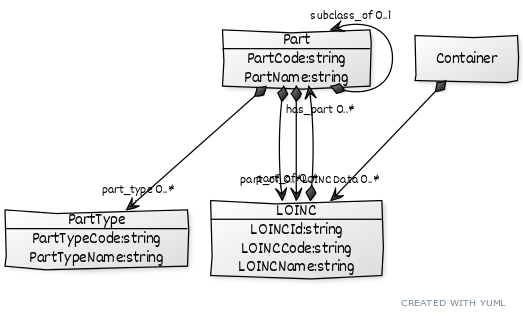

# LOINC Information Schema

A schema/model to demonstrate use of LinkML.

 * [loincinfo.yaml](Schema/loincinfo.yaml) -- schema source
 * [Data/](Data) -- LOINC data files
 * [Output/](Output) -- derived data files

## Schema Diagram

generated via `gen-yuml`:

