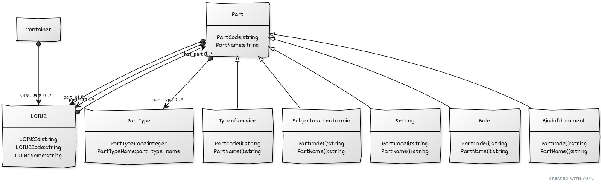

# LOINC Information Schema
This folder is located here: https://github.com/loinc/comp-loinc/linkml

A schema/model to demonstrate use of LinkML using initial LOINC Hierarchy and LPL data. For more information, please visit (https://linkml.io/linkml/index.html)

 * [loincinfo.yaml](loincinfo.yaml) -- schema source 
 * [loincinfo.py](loincinfo.py) -- generated python datamodel 
 * [Hierarchy_and_LPL_data.xlsx](Hierarchy_and_LPL_data.xlsx) -- schema source 
 * [data.ttl](data.ttl) -- output data

## Schema Diagram

generated via `gen-yuml`:

